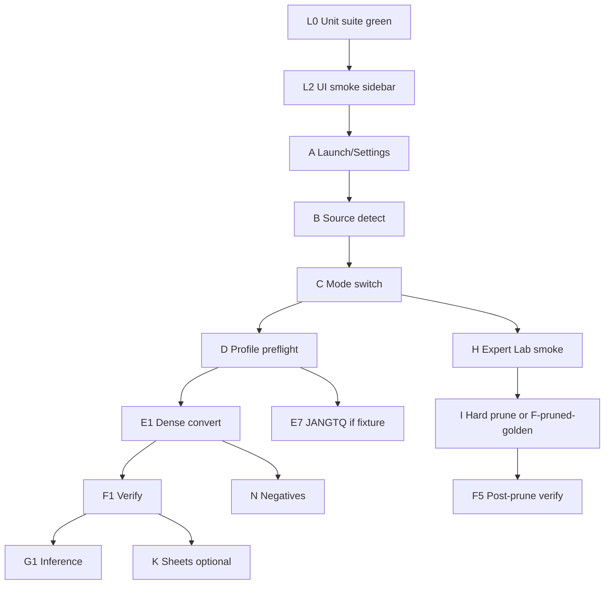

# JANG Studio — Thorough End-to-End Test Plan

| Field | Value |
|---|---|
| **Date** | 2026-07-12 |
| **App** | JANG Studio (`ai.jangq.JANGStudio`) |
| **Codebase** | `JANGStudio/` under jangq monorepo |
| **Status** | Plan (ready to execute) |
| **Related** | `docs/plans/2026-07-12-jang-studio-mode-architecture-cli-pr-plan.md` (PR1–PR3) |

---

## 1. Purpose

Validate **real user journeys** through JANG Studio: folder pick → detect → mode choice → profile/preflight → convert → verify → post-verify actions (inference, Expert Lab, publish, diagnostics), plus failure, cancel, and recovery paths.

This plan is intentionally broader than unit tests. Unit coverage is already strong (~20 suites); E2E is thin (one UI smoke test). The goal is to prove the **shipped binary + bundled Python** works on Apple Silicon with real or fixture models.

### Success criteria for a full E2E cycle

- Every **P0** scenario passes on the target machine class (see §3).
- Every **P1** scenario passes or has an explicit waiver with owner + follow-up issue.
- No data-loss bugs: cancel does not delete successful output; re-pick source does not corrupt `detected`.
- Mode UX matches PR3: Convert = 4 steps; Expert Lab MoE = 6; dense never shows Expert Lab steps.
- JANGTQ hard-fail (PR1): unmapped arch never spawns wrong converter.

---

## 2. Test strategy layers

| Layer | What | Tooling | Owner cadence |
|---|---|---|---|
| **L0 Unit** | Pure builders, gates, parsers, verifiers | `xcodebuild test -only-testing:JANGStudioTests` | Every PR |
| **L1 Integration** | Subprocess + fake/real CLI, temp dirs | XCTest + `fake_convert.sh` + temp HF trees | Every PR |
| **L2 UI smoke** | Launch, sidebar, primary buttons | `JANGStudioUITests` (XCUITest) | Every PR |
| **L3 Process E2E (manual + scripted)** | Real models, real convert, Expert Lab, HF | Checklist + shell harness | Pre-release / nightly |
| **L4 Soak / stress** | Long convert, cancel races, disk fill, multi-run | Manual + scripts | Pre-release |

This document focuses on **L2–L4**, with L0/L1 gates called out where they must stay green.

---

## 3. Environments & prerequisites

### 3.1 Machines (matrix)

| ID | Hardware | RAM | Disk free | Role |
|---|---|---|---|---|
| M-small | M1/M2 16–24 GB | 16–24 GB | ≥ 50 GB | Dense tiny + fail/OOM-ish paths |
| M-mid | M2/M3 Pro 36–48 GB | ≥ 36 GB | ≥ 100 GB | Small MoE JANG + short Expert Lab smoke |
| M-large | M2 Ultra / M3 Max / Studio | ≥ 64–128 GB | ≥ 500 GB | Full MoE JANGTQ + Expert Lab suite + long convert |

**Ship bar:** P0 on M-mid; P0 Expert Lab subset on M-large when Expert Lab is in the release notes.

### 3.2 Builds under test

| Build | Purpose |
|---|---|
| Debug (Xcode) | Dev iteration, UI tests, `JANGSTUDIO_PYTHON_OVERRIDE` |
| Release ad-hoc | Bundle path + hardened runtime sanity |
| Notarized DMG (if shipping) | Gatekeeper, first-launch, signed Python dylibs |

Record for every run: git SHA, marketing version, build number, Python bundle path/hash, `jang-tools` version (`python -m jang_tools --version` or package metadata).

### 3.3 Fixtures (models)

Prefer **immutable fixture trees** under a known root (e.g. `~/Models/e2e/` or external volume). Do not mutate golden sources; always write outputs to a scratch tree.

| Fixture ID | Shape | Approx size | Used for |
|---|---|---|---|
| F-dense-tiny | Small dense HF (e.g. 0.5B–1B), BF16, `config.json` + shards | &lt; 5 GB | Convert happy path, UI, verify, inference |
| F-dense-fp16 | Dense FP16 | small–med | dtype detection, overrides |
| F-moe-qwen-sm | `qwen3_5_moe` or text, BF16, as small as practical | medium | JANGTQ + Expert Lab entry |
| F-moe-qwen-vl | Wrapper VL (`qwen3_5_moe_wrapper` + text type) if available | med–large | VL preflight + module map via `textModelType` |
| F-moe-minimax | `minimax_m2` if available | large | MiniMax module + custom `.py` verify |
| F-broken-no-shards | `config.json` only | tiny | Step1 incomplete, detection error UX |
| F-broken-parent | Parent of real model | tiny | Wrong-folder UX |
| F-already-jang | Prior JANG output | varies | Re-quantize / dtype jangV2 messaging |
| F-pruned-golden | Pre-built reviewed pruned BF16 + sidecars | med | Skip long Expert Lab; test final quant + verify gates |

**Minimum to execute P0 Convert:** F-dense-tiny.  
**Minimum to execute P0 Expert Lab smoke:** F-moe-qwen-sm **or** F-pruned-golden (final quant only).

### 3.4 Accounts / secrets

| Secret | Used by | Notes |
|---|---|---|
| HF token (write) | Publish sheet | Optional; use throwaway repo |
| HF token (read) | Download fixtures | Optional if fixtures local |
| None | Core convert/verify | Default |

Never commit tokens. E2E publish uses a private throwaway repo then delete.

### 3.5 Tooling

```bash
# Unit + UI (from JANGStudio/)
xcodebuild test -scheme JANGStudio -destination 'platform=macOS' \
  -only-testing:JANGStudioTests
xcodebuild test -scheme JANGStudio -destination 'platform=macOS' \
  -only-testing:JANGStudioUITests

# Optional: override Python for debug
export JANGSTUDIO_PYTHON_OVERRIDE="$(which python3)"

# Capture diagnostics after failures
# App: Run → Copy Diagnostics / Verify → diagnostics
# Also: Console.app filter subsystem / process JANGStudio
```

Recommend a **run log template** (appendix A) filled per session.

---

## 4. Coverage map (product surface → test areas)

| Product surface | Key code | E2E area IDs |
|---|---|---|
| Launch / Settings | `JANGStudioApp`, `SettingsWindow`, `AppSettings` | A |
| Source detect + recommend | `SourceStep`, `SourceDetector`, `RecommendationService` | B |
| Mode switch Convert / Expert Lab | `WizardMode`, `visibleSteps`, Source CTAs | C |
| Profile + preflight + overrides | `ProfileStep`, `PreflightRunner`, CLI flags | D |
| Run convert / cancel / retry | `RunStep`, `PythonRunner`, `CLIArgsBuilder` | E |
| Verify + finish / convert another | `VerifyStep`, `PostConvertVerifier` | F |
| Test inference | `TestInferenceSheet`, `InferenceRunner` | G |
| Expert Lab review | `ExpertLabSheet`, Expert Review step | H |
| Hard prune | `PrequantPruneSheet`, Prune Review | I |
| Router-only prune | Source under Convert | J |
| Publish / model card / examples | Sheets + services | K |
| Diagnostics / path anonymize | `DiagnosticsBundle` | L |
| Negative / security / integrity | Wrong arch, disk, OOM, corrupt shards | N |
| Regression for PR1–PR3 | Module hard-fail, Architecture gone, modes | R |

---

## 5. Priority definitions

| Priority | Meaning | Release gate |
|---|---|---|
| **P0** | Blocks release / data loss / wrong quantizer | Must pass |
| **P1** | Core feature broken for common users | Must pass or waive |
| **P2** | Power-user / edge | Best effort pre-release |
| **P3** | Nice-to-have / soak | Nightly or quarterly |

---

## 6. Scenarios (detailed)

Each scenario: **ID · Priority · Setup · Steps · Expected · Evidence**.

### A — Launch, shell, settings

#### A1 · P0 · Cold launch Convert sidebar
- **Setup:** Fresh launch (no prior plan).
- **Steps:** Open app.
- **Expected:** Window ≥ 960×640; sidebar shows **4** steps only:  
  `1 · Source Model`, `2 · Conversion Profile`, `3 · Build / Convert`, `4 · Verify`.  
  No Expert Review / Prune Review rows.
- **Evidence:** Screenshot sidebar; optional XCUITest `test_sidebarListsConvertStepsAtLaunch`.

#### A2 · P1 · Settings defaults apply to new plan
- **Setup:** Settings → General → Defaults: profile `JANG_2L`, family `jang`, method `rtn`, hadamard on.
- **Steps:** Quit/relaunch or Verify → Convert another; open Profile without changing defaults.
- **Expected:** Profile/method/hadamard match settings (not hardcoded 4K/mse only).
- **Evidence:** Screenshot Profile + Settings.

#### A3 · P1 · Settings: Python override + custom jang_tools path
- **Setup:** Debug build; set Python override to a known `python3` with jang installed; optional custom `PYTHONPATH`.
- **Steps:** Preflight → bundled Python healthy / convert smoke with F-dense-tiny tiny profile.
- **Expected:** Child process uses override; convert progresses (or clear error if broken path).
- **Evidence:** Log line / Activity Monitor process path.

#### A4 · P2 · Settings: tick throttle, thread count, anonymize diagnostics
- **Steps:** Set non-default throttle/threads; run short convert; Copy Diagnostics with anonymize on/off.
- **Expected:** Env vars reflected (where observable); anonymize strips home paths in zip when on.
- **Evidence:** Open diagnostics `plan.json` / logs.

---

### B — Source detection & recommendation

#### B1 · P0 · Happy detect dense
- **Setup:** F-dense-tiny.
- **Steps:** Choose Folder → wait for Detected section.
- **Expected:** model type, Dense, dtype, GB, shard count &gt; 0; Continue enabled; no Expert Lab segment (or Expert Lab unavailable copy).
- **Evidence:** Screenshot Detected card.

#### B2 · P0 · Happy detect MoE
- **Setup:** F-moe-qwen-sm.
- **Steps:** Choose Folder.
- **Expected:** MoE layout, expert counts; **Convert | Expert Lab** segment visible; default Convert; Continue → Profile (not forced into Expert Lab).
- **Evidence:** Screenshot Workflow section.

#### B3 · P0 · Wrong folder / no shards
- **Setup:** F-broken-no-shards or parent folder.
- **Steps:** Choose Folder.
- **Expected:** Hard fail copy about no `.safetensors` / not HF model; Continue disabled; `isStep1Complete` false.
- **Evidence:** Screenshot error.

#### B4 · P1 · Re-pick folder cancels stale detection
- **Setup:** Slow large model then quickly re-pick tiny model (or inject delay in debug if available).
- **Steps:** Pick large → immediately pick tiny before first detect finishes.
- **Expected:** Final `detected` matches tiny path only; no stomp from first task.
- **Evidence:** Detected card path + type; no error flash from cancelled task.

#### B5 · P1 · Recommendation apply vs preserve manual profile
- **Steps:** Let recommendation apply; go Profile and change profile; re-detect same/different model.
- **Expected:** Manual profile not blindly overwritten when user left defaults; settings default used for “still at default” logic.
- **Evidence:** Profile name before/after.

#### B6 · P2 · VL / video-VL badges
- **Setup:** VL fixture if available.
- **Expected:** Vision / Video labels; later verify requires preprocessor files.

---

### C — Mode switch (PR3)

#### C1 · P0 · Dense never shows Expert steps
- **Setup:** F-dense-tiny; try to force Expert Lab if control hidden.
- **Expected:** Sidebar always 4 steps; Expert Review not activatable.
- **Evidence:** Sidebar screenshot.

#### C2 · P0 · MoE Convert keeps 4 steps
- **Setup:** F-moe-qwen-sm, Convert selected.
- **Steps:** Navigate Continue to Profile; click sidebar entries.
- **Expected:** Titles renumbered 1–4; Expert/Prune absent; lock icons only on incomplete steps.
- **Evidence:** Screenshot.

#### C3 · P0 · MoE Expert Lab shows 6 steps
- **Steps:** Select Expert Lab → Analyze Experts… (or Continue with Expert Lab selected).
- **Expected:** Sidebar: Source, Expert Review, Prune Review, Profile, Build, Verify with titles 1–6; Expert Review active when allowed.
- **Evidence:** Screenshot.

#### C4 · P0 · Segment switch clears in-progress session
- **Steps:** Enter Expert Lab mid-setup (intent set); switch segment back to Convert.
- **Expected:** `setWorkflowMode(.convert)` clears in-progress plan/source URLs for review session; does not delete already-adopted pruned source if present; `ensureActiveIsVisible` snaps selection.
- **Evidence:** No blank detail pane; active step still in list.

#### C5 · P0 · Post-adopt collapses to Convert
- **Setup:** Complete prune adopt (or inject via F-pruned-golden adoption path).
- **Expected:** `workflowMode == convert`; Expert steps gone; Profile shows Reviewed BF16 source card; selection not stuck on Prune Review.
- **Evidence:** Sidebar + Profile section.

#### C6 · P1 · Convert another resets mode
- **Steps:** After verify success → Convert another.
- **Expected:** Fresh plan, Convert mode, Source active, settings defaults reapplied.
- **Evidence:** Sidebar 4 steps.

#### C7 · P1 · Sidebar cannot jump to locked steps
- **Steps:** On Source incomplete, click Profile/Run/Verify.
- **Expected:** Click ignored; stay on Source (or current allowed).
- **Evidence:** Active step unchanged.

---

### D — Profile, preflight, overrides

#### D1 · P0 · Preflight blocks Start when red
- **Steps:** Missing output / insufficient disk / JANGTQ on llama.
- **Expected:** Start Conversion disabled; red rows with hints.
- **Evidence:** Screenshot Pre-flight.

#### D2 · P0 · JANGTQ whitelist + module (PR1)
- **Cases:**
  1. Qwen MoE + JANGTQ → arch check **pass**, args non-empty.
  2. Llama + JANGTQ → arch check **fail** (not allowed).
  3. Synthetic/future type on whitelist without module (if injectible via debug) → fail **module** hint.
  4. VL wrapper with `textModelType=qwen3_5_moe_text` → **pass** module Qwen.
- **Expected:** No silent Qwen converter for unknown types.
- **Evidence:** Preflight hint text; optional log of argv (debug).

#### D3 · P1 · Family switch resets invalid profile
- **Steps:** JANG_4K → switch to JANGTQ → profile becomes JANGTQ3 (or valid); reverse.
- **Expected:** Menu only lists valid names; auto output folder renames if still auto-generated.

#### D4 · P1 · Advanced overrides emit CLI flags (JANG only)
- **Steps:** Force dtype bf16, block size 128; start convert; inspect diagnostics / process args if available.
- **Expected:** `-b 128` and `--force-dtype bf16` for JANG; JANGTQ ignores overrides.
- **Evidence:** Diagnostics or fake_convert echo.

#### D5 · P1 · Output path settings
- **Steps:** Set default output parent + naming template `{basename}-{profile}`; change profile.
- **Expected:** Auto path updates; user-chosen custom path not overwritten.
- **Evidence:** Output path string.

#### D6 · P2 · Hadamard vs low-bit warning
- **Steps:** 2-bit profile + hadamard on.
- **Expected:** Preflight warn/fail per product rules; guidance cards update.

#### D7 · P1 · Reviewed prune gate on Profile
- **Setup:** Adopted pruned source with missing/failed verification.json.
- **Expected:** Start/Quantize disabled; reviewed-prune preflight fail.
- **Setup2:** Verified pruned source.
- **Expected:** Quantize enabled.

---

### E — Run / convert process

#### E1 · P0 · Full convert dense happy path
- **Setup:** F-dense-tiny, JANG_4K or JANG_2L, free disk OK.
- **Steps:** Start Conversion; wait for success; Continue → Verify.
- **Expected:** Phases progress; logs stream; `.done` success; run=succeeded; output dir populated.
- **Evidence:** Output listing + verify later green.

#### E2 · P0 · Cancel mid-convert
- **Steps:** Start on larger fixture; Cancel after progress &gt; 0.
- **Expected:** Process stops ≤ ~5s (SIGTERM/SIGKILL); run=cancelled; optional auto-delete partial if setting on; **no** delete if conversion already completed (race).
- **Evidence:** Process gone; disk state; log `[cancelled]`.

#### E3 · P0 · Retry after failure
- **Steps:** Induce fail (full disk or kill python); Retry.
- **Expected:** New run; logs cleared appropriately; can succeed if cause fixed.

#### E4 · P0 · Empty argv hard-fail (PR1)
- **Steps:** Force JANGTQ + unmapped arch if UI allows; or debug inject.
- **Expected:** run=failed **without** flash of running; log contains module mapping / URL reason; no orphan python.
- **Evidence:** Log pane.

#### E5 · P1 · Nav away / close window mid-convert
- **Steps:** Start convert; close window or leave Run step (onDisappear).
- **Expected:** Task cancelled; subprocess terminated; no multi-hour orphan CPU peg.
- **Evidence:** `ps` / Activity Monitor.

#### E6 · P1 · Disk re-check before start
- **Steps:** Green preflight then fill disk below estimate; Start.
- **Expected:** Fail at preflight re-check message before long run.

#### E7 · P1 · JANGTQ convert Qwen / MiniMax
- **Setup:** F-moe-qwen-sm / F-moe-minimax; profile JANGTQ3.
- **Expected:** Correct module; progress events; success.
- **Evidence:** Output `jang_config` / weight_format mxtq where applicable.

#### E8 · P2 · Long-run soak
- **Setup:** Large MoE + multi-hour budget on M-large.
- **Expected:** Completes or fails with remediating error (OOM/disk), not hang; cancel still works hour 2.

#### E9 · P1 · Copy Diagnostics on failure
- **Expected:** Zip on Desktop; contains plan, logs, events; opens in Finder.

---

### F — Verify & finish

#### F1 · P0 · Verify all required green after good convert
- **Expected:** Required checks pass; Finish enabled; optional warn rows OK.
- **Evidence:** Checklist screenshot.

#### F2 · P0 · Verify blocks Finish on required fail
- **Setup:** Manually break output (delete `tokenizer.json` or shard).
- **Steps:** Re-open verify / re-run checks.
- **Expected:** Finish disabled; fail row + hint.

#### F3 · P1 · Convert another
- **Expected:** Clean slate; can run second convert without restart.

#### F4 · P1 · Reveal output / copy path
- **Expected:** Finder selection; pasteboard path.

#### F5 · P1 · Post-reviewed-prune verify extras
- **Setup:** Final quant from F-pruned-golden.
- **Expected:** Reviewed prune rows + native smoke if not skipped; final comparison artifacts.

#### F6 · P2 · Skip-python-validate not used in production path
- **Expected:** Real `jang validate` invoked (schemaValid).

---

### G — Test inference (post-verify)

#### G1 · P0 · Load converted model and complete one prompt
- **Setup:** Successful F-dense-tiny convert.
- **Steps:** Test Inference → sample prompt → Send.
- **Expected:** Stream or complete text; tokens/s &gt; 0; no crash; Cancel works mid-gen.
- **Evidence:** Chat bubble + stats.

#### G2 · P1 · Clear / export transcript
- **Expected:** Clear empties; Export writes file.

#### G3 · P2 · Multimodal drop targets (if VL model)
- **Expected:** Image attach path works or clear unsupported message.

#### G4 · P1 · Dismiss sheet cancels inference task
- **Expected:** No orphan inference process after close.

---

### H — Expert Lab (process-heavy)

> Run on M-large; time-box suite size (Smoke 21 → Reviewed 50).

#### H1 · P0 · Open BF16 Expert Review from Source
- **Steps:** MoE → Expert Lab → Analyze Experts.
- **Expected:** ExpertLabSheet embeds; source immutable; empty atlas until prompts run.

#### H2 · P0 · Run smoke suite / live prompt
- **Steps:** Explicit run (no auto-run on entry per design direction).
- **Expected:** Trace artifacts; atlas populates; no crash.

#### H3 · P1 · Atlas modes (Map / Cards / Table)
- **Expected:** Mode switch works; selection border visible.

#### H4 · P1 · Mask + compare
- **Steps:** Disable experts; compare baseline vs masked.
- **Expected:** Comparison tray; deltas; cannot prune without evidence (gated).

#### H5 · P0 · Export prune plan
- **Expected:** Plan URL set; navigation to Prune Review enabled; plan JSON has safety block.

#### H6 · P2 · Persist/reopen run
- **Expected:** History reopen shows eval/output (fix any stale UI tests).

#### H7 · P1 · Suite size switch (21 / 50 / 150)
- **Expected:** Longer suites take longer; cancel mid-suite safe.

---

### I — Hard prune (BF16/F16)

#### I1 · P0 · Execute reviewed prune plan
- **Steps:** Prune Review with valid plan; choose output ≠ source; run prune.
- **Expected:** New directory; original untouched; `prune_plan.json` + `verification.json` + review sidecars; adopt → Profile.

#### I2 · P0 · Refuse prune into source path
- **Expected:** Guard / error; no delete of source.

#### I3 · P1 · Failed verification blocks final quant
- **Expected:** Profile/Run blocked until verification green.

#### I4 · P2 · Clean partial prune output and retry

---

### J — Router-only prune (Convert mode)

#### J1 · P1 · Available for raw Qwen MoE only
- **Expected:** Disabled/hint for unsupported types; for supported, completes plan without same-suite unlock for final quant.

#### J2 · P1 · Cannot satisfy reviewed-prune preflight alone
- **Expected:** Final quant still blocked without Expert Lab same-suite evidence.

---

### K — Adoption sheets (Verify)

#### K1 · P1 · Usage examples generate
- **Expected:** Markdown/code samples; retry on fail; dismiss cancels task.

#### K2 · P1 · Generate model card
- **Expected:** Preview + write option; error remediation.

#### K3 · P1 · Publish to Hugging Face (optional network)
- **Steps:** Dry-run if available; then publish to throwaway repo.
- **Expected:** Clear 401/403/network errors; success URL; cancel mid-upload.
- **Evidence:** HF repo page then delete repo.

#### K4 · P2 · Publish path anonymize / token not logged
- **Expected:** Diagnostics/logs do not print full token.

---

### L — Diagnostics & observability

#### L1 · P0 · Diagnostics zip completeness
- **Contents:** `plan.json` (includes `workflowMode`), logs, events, system, verify if present.
- **Expected:** Valid zip; useful for bug report.

#### L2 · P1 · ProcessError remediation strings
- **Setup:** Induce OOM / disk / missing modeling_*.py if possible.
- **Expected:** User-facing “→ …” remediation line.

---

### N — Negative / integrity / security

#### N1 · P0 · Never run wrong JANGTQ module
- Covered by D2 + E4.

#### N2 · P1 · Corrupt safetensors
- **Expected:** Fail with re-download remediation; partial output not marked success.

#### N3 · P1 · Missing trust_remote_code py (MiniMax)
- **Expected:** Fail with download-including-py remediation.

#### N4 · P2 · Entitlements: user-selected paths only (as designed)
- **Expected:** Can read chosen model dirs; no unexpected TCC prompts beyond first folder access.

#### N5 · P1 · Gatekeeper / damaged app (release)
- **Expected:** Documented `xattr -cr` recovery; notarized build opens clean.

---

### R — Regression matrix (PR1–PR3)

| ID | Check | Priority |
|---|---|---|
| R1 | Unmapped JANGTQ → empty argv + preflight fail | P0 |
| R2 | VL wrapper JANGTQ via textModelType works | P0 |
| R3 | ArchitectureStep absent; overrides on Profile | P0 |
| R4 | Convert 4 / Expert 6 step titles dynamic | P0 |
| R5 | adopt → convert mode + selection snap | P0 |
| R6 | Dense re-pick forces convert | P0 |
| R7 | Codable heal: convert + in-progress session → expertLab (fixture/diagnostics) | P1 |
| R8 | Unit suite: CLIArgs, ConversionPlan mode, Wizard gates green | P0 |

---

## 7. Suggested execution order (one release cycle)



### Day plan (example)

| Day | Focus | Machine |
|---|---|---|
| 1 | L0 + L2 + A–D + E1/F1/G1 dense | M-small/mid |
| 2 | Cancel/retry/diagnostics + negatives N1–N3 | M-mid |
| 3 | JANGTQ Qwen + VL wrapper | M-mid/large |
| 4 | Expert Lab smoke + prune (or golden pruned) + final quant | M-large |
| 5 | Publish optional + soak E8 + release DMG Gatekeeper | M-large |

---

## 8. Automation backlog (make E2E cheaper)

Prioritize engineering investment after first manual cycle:

| # | Automation | Layer | Notes |
|---|---|---|---|
| 1 | Expand XCUITest: Convert vs Expert Lab sidebar after mock detect | L2 | Needs test hooks or fixture injection |
| 2 | **Test hooks** (DEBUG): inject `ArchitectureSummary`, skip real panel | L2/L3 | `JANGSTUDIO_E2E_FIXTURE=...` |
| 3 | Scripted convert via `CLIArgsBuilder` + bundled python on fixture | L3 | Headless CI on Mac runner |
| 4 | Golden output verify via `PostConvertVerifier` on known good trees | L1/L3 | Already partly unit-tested |
| 5 | Expert Lab: keep unit/source contracts; full suite stays manual | L3 | Cost |
| 6 | Fix stale ExpertLabWorkflowFlowTests string pins | L0 | Unblock CI noise |
| 7 | Snapshot/visual QA for Expert Lab blank atlas + selection | L2 | Optional |

### Recommended DEBUG test hooks (design for implementers)

```text
JANGSTUDIO_E2E=1
JANGSTUDIO_E2E_SOURCE=/path/to/fixture
JANGSTUDIO_E2E_AUTO_DETECT=1
JANGSTUDIO_E2E_SKIP_OPEN_PANEL=1
JANGSTUDIO_FAKE_CONVERT=1   # reuse fake_convert.sh
```

Without hooks, UI E2E is blocked on `NSOpenPanel` automation flakiness—plan manual for folder pick or use Accessibility + fixed bookmarks.

---

## 9. Pass / fail & sign-off

### Exit statuses

| Status | Definition |
|---|---|
| **PASS** | Expected behavior observed; evidence attached |
| **FAIL** | Wrong behavior; file bug with diagnostics zip + steps |
| **BLOCKED** | Missing fixture/hardware/secret |
| **WAIVED** | Known limitation; product owner signs |

### Release sign-off checklist

- [ ] All P0 PASS on M-mid (Convert path)
- [ ] All P0 mode (C*) PASS
- [ ] All P0 PR1 JANGTQ integrity PASS
- [ ] Expert Lab P0 either PASS on M-large **or** explicitly out-of-scope for this tag
- [ ] No open P0 bugs
- [ ] Unit suite green except listed pre-existing waivers
- [ ] Diagnostics from one intentional failure reviewed for quality

### Bug template (file against failures)

```text
Title: [E2E] <area> <symptom>
Build: version / SHA / machine
Scenario ID: e.g. E2
Fixture: F-dense-tiny
Steps: ...
Expected: ...
Actual: ...
Attachments: diagnostics zip, screenshots, Console log
```

---

## 10. Traceability to existing automated tests

| Area | Existing automation | E2E still needed? |
|---|---|---|
| CLIArgs / JANGTQ module | `CLIArgsBuilderTests`, CoverageMatrix | Yes (real python) |
| Preflight | `PreflightRunnerTests` | Yes (UI disable Start) |
| Mode gates | `ExpertLabWorkflowFlowTests`, `WizardStepContinueGateTests` | Yes (real sidebar) |
| Python cancel | `PythonRunnerTests`, `PythonCLIInvokerTests` | Yes (UI cancel + window close) |
| Verifier file matrix | `PostConvertVerifierTests`, fixtures good/broken | Yes (after real convert) |
| Publish errors | `AdoptionServicesTests` | Optional network E2E |
| UI sidebar | `WizardFlowTests` Convert 4-step | Expand Expert Lab |

---

## 11. Risks & mitigations

| Risk | Mitigation |
|---|---|
| Large MoE tests too slow/expensive | F-pruned-golden for final quant; smoke suite 21 for Lab |
| NSOpenPanel hard to automate | Manual pick + DEBUG hooks later |
| Flaky GPU/MLX | Pin mlx versions; record thermal/throttling |
| Data loss on cancel race | Explicit E2 + auto-delete setting matrix |
| False confidence from unit-only | Require L3 dense convert before tag |

---

## 12. Appendix A — Run log template

```text
# JANG Studio E2E Run Log
Date:
Operator:
Machine ID: M-small | M-mid | M-large
Build: version / git SHA
Python: bundled | override path
jang-tools:

Fixtures available: [list]

| Scenario | Result | Notes | Evidence path |
|---|---|---|---|
| A1 | PASS/FAIL |  |  |
| B1 |  |  |  |
...

P0 summary: x/y passed
P1 summary: x/y passed
Sign-off: name / date
```

---

## 13. Appendix B — Minimal P0 script (Convert only)

Executable in half a day on M-mid with F-dense-tiny:

1. A1 Launch sidebar  
2. B1 Detect dense  
3. D1 Preflight gate (force bad output once)  
4. D5 Output path  
5. E1 Convert success  
6. E2 Cancel on second run  
7. E9 Diagnostics  
8. F1 Verify green  
9. G1 Inference one prompt  
10. C1 Dense no Expert steps  
11. R3 Overrides on Profile  
12. F3 Convert another  

MoE P0 add-on (when fixture ready): B2, C2, C3, D2, E7 or R1/R2.

Expert Lab P0 add-on (M-large): H1, H2, H5, I1, C5, F5 — **or** skip Lab and use F-pruned-golden for I/F5 only.

---

## 14. Appendix C — Scenario count summary

| Area | P0 | P1 | P2+ |
|---|---:|---:|---:|
| A Launch/Settings | 1 | 2 | 1 |
| B Source | 3 | 2 | 1 |
| C Mode | 5 | 2 | 0 |
| D Profile | 2 | 4 | 1 |
| E Run | 4 | 3 | 1 |
| F Verify | 2 | 3 | 1 |
| G Inference | 1 | 2 | 1 |
| H Expert Lab | 3 | 3 | 1 |
| I Prune | 2 | 1 | 1 |
| J Router prune | 0 | 2 | 0 |
| K Sheets | 0 | 3 | 1 |
| L Diagnostics | 1 | 1 | 0 |
| N Negative | 1 | 3 | 1 |
| R Regression | 6 | 1 | 0 |
| **Approx total** | **~31 P0** | **~29 P1** | **~10 P2** |

---

## 15. Next actions (implementation of this plan)

1. **Assemble fixture shelf** (`F-dense-tiny` mandatory; MoE optional package).  
2. **Run Appendix B** on current Debug build; file bugs.  
3. **Implement DEBUG E2E hooks** (§8) for CI-friendly UI tests.  
4. **Fix stale ExpertLabWorkflowFlowTests** string pins (CI noise).  
5. **Automate** headless convert+verify script for F-dense-tiny on Mac CI.  
6. **Before each release tag:** re-run P0 matrix; attach run log to release notes.

---

*End of plan.*
