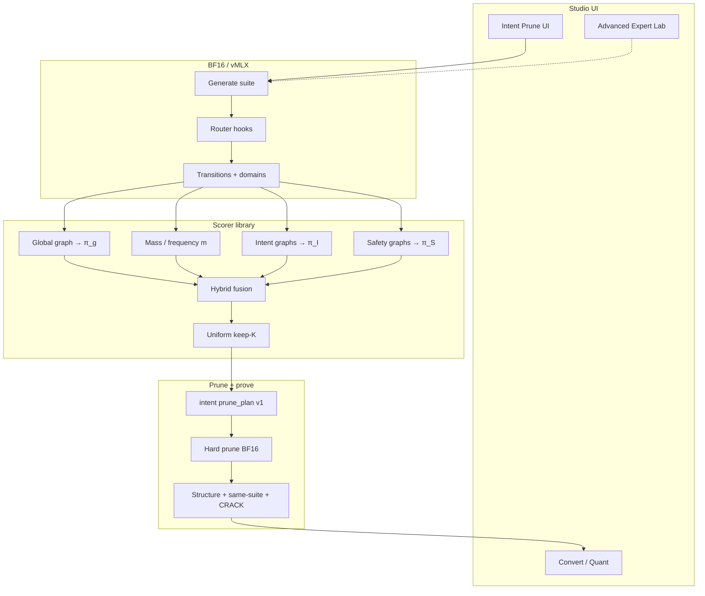

# JANG Studio — Intent Prune + CRACK (Full Plan)

| Field | Value |
|---|---|
| **Title** | Intent Prune with Hybrid (MAESTRO-class) Scoring and First-Class CRACK Abliteration |
| **Date** | 2026-07-12 |
| **Status** | Full plan — implementation-ready |
| **Author** | Product/engineering plan from Studio review + MAESTRO discussion |
| **Product** | JANG Studio prune path (quant path unchanged) |
| **Codebases** | `JANGStudio/`, `jang-runtime` (`JANGExpertLab`), `jang-tools` |
| **Related plans** | `2026-07-12-jang-studio-mode-architecture-cli-pr-plan.md` · `2026-07-12-jang-studio-e2e-test-plan.md` |

---

## Executive summary

**Quantization is good enough.** Users can pick a model, pick a profile, convert, and verify. That flow stays.

**Pruning is the product gap.** Today it is Expert Lab–centric (atlas, mask, compare). Users think in capabilities:

- “I need **coding**, not astrophysics.”
- “Keep **biology**.”
- “**CRACK** — abliteration / fewer refusals” (same brand as shipped `*-CRACK` models).

This plan replaces the *default* prune experience with **Intent Prune**:

1. Choose **intents** + **safety stance** (Keep / Balanced / **CRACK**).
2. Run **Reviewed 50** (+ CRACK probe pack when CRACK).
3. Score experts with a **hybrid** that includes **MAESTRO-class path importance**, not only REAP-style marginal saliency.
4. **Uniform keep-K** per layer → hard-prune BF16 → same-suite verify → existing Convert/quant.

**CRACK** is the official JANG **abliteration** label.  
**Expert Lab** remains Advanced.  
**Recovery fine-tune** is out of the v1 happy path.  
**Qwen MoE first**; architecture contract is pluggable for broad compatibility later.

---

## Table of contents

1. [Problem statement](#1-problem-statement)  
2. [Goals, non-goals, success metrics](#2-goals-non-goals-success-metrics)  
3. [Key decisions](#3-key-decisions)  
4. [Current architecture](#4-current-architecture)  
5. [MAESTRO vs REAP and the hybrid scorer](#5-maestro-vs-reap-and-the-hybrid-scorer)  
6. [Product design (UX)](#6-product-design-ux)  
7. [CRACK abliteration](#7-crack-abliteration)  
8. [Reviewed 50 and suites](#8-reviewed-50-and-suites)  
9. [Technical design](#9-technical-design)  
10. [Data models and artifacts](#10-data-models-and-artifacts)  
11. [Algorithms (normative)](#11-algorithms-normative)  
12. [Studio integration](#12-studio-integration)  
13. [Verification and gates](#13-verification-and-gates)  
14. [Evaluation and bake-off](#14-evaluation-and-bake-off)  
15. [Security, policy, naming](#15-security-policy-naming)  
16. [Testing strategy](#16-testing-strategy)  
17. [Rollout and risks](#17-rollout-and-risks)  
18. [PR plan](#18-pr-plan)  
19. [Timeline and staffing sketch](#19-timeline-and-staffing-sketch)  
20. [Open questions](#20-open-questions)  
21. [Appendix](#21-appendix)  

---

## 1. Problem statement

### 1.1 What users want

| Intent (user language) | System meaning |
|---|---|
| Smaller / faster MoE | Drop experts that do not support selected capabilities |
| “Good at coding” | Protect experts on coding routing paths |
| “Not astrophysics” | Do not spend capacity on unused knowledge domains |
| **CRACK** | Abliteration: reduce refusal/safety-path specialization while keeping task capability |

### 1.2 What we ship today

```text
Source (MoE)
  → Expert Lab (trace suite → atlas → mask/compare → export plan)
  → Hard-prune BF16/F16
  → Structural + same-suite verify
  → JANG / JANGTQ quant (straightforward)
```

This is powerful for experts and weak for everyone else. Router-only prune is too weak to unlock “reviewed” quant. REAP and mass-based scores optimize **marginal** expert importance, not **path** importance and not **user intent**.

### 1.3 What we will ship

```text
Source (Qwen MoE v1)
  → Intent Prune UI (intents + Keep/Balanced/CRACK + budget)
  → Reviewed 50 (+ CRACK pack if CRACK) on BF16/vMLX
  → Hybrid scores (path + mass + domain + safety term)
  → Uniform keep-K prune_plan
  → Hard-prune → verify → Convert (existing quant)
```

Expert Lab: Advanced. Quant: unchanged.

---

## 2. Goals, non-goals, success metrics

### 2.1 Goals

| ID | Goal |
|---|---|
| G1 | Intent Prune v1 for **Qwen MoE** (`qwen3_5_moe`, `qwen3_5_moe_text`, VL wrapper via `textModelType`) |
| G2 | Default scorer **hybrid**, strictly intended to beat pure REAP/mass on TRACE/intent holdouts |
| G3 | **CRACK** first-class abliteration stance; naming, confirm, eval |
| G4 | **Reviewed 50** is the authority suite; Smoke 21 cannot unlock final quant |
| G5 | Arch-agnostic scorer + plan schema; pluggable backends for broad compat later |
| G6 | No recovery fine-tune on happy path |
| G7 | Expert Lab demoted to Advanced; Intent is primary MoE prune entry |
| G8 | Quant/Convert path remains the simple default when user skips prune |

### 2.2 Non-goals (v1)

| ID | Non-goal |
|---|---|
| N1 | MiniMax/GLM/other MoE Intent backends (v1.1+) |
| N2 | Learned fusion weights |
| N3 | Higher-order Markov (≥2) as default |
| N4 | Attention-LoRA recovery in Studio v1 |
| N5 | Dense-model residual abliteration (future CRACK path) |
| N6 | Changes to JANG quant bit math or profiles |
| N7 | Shipping jailbreak recipe content in-app |

### 2.3 Success metrics

| Metric | Target (finalize numbers in IP5 bake-off) |
|---|---|
| Intent flow without opening atlas | Supported |
| Coding-intent TRACE retention vs unpruned | Within agreed band at Standard budget |
| CRACK pack refusal rate vs Keep | Meaningfully lower |
| Keep-intent collapse under CRACK | Within agreed floor (fail plan if breached) |
| Hybrid vs REAP/mass on holdout | Hybrid wins or ties on primary metrics, wins on intent-conditioned metrics |
| Time-to-pruned model (Qwen, Standard) | Single linear Studio session |
| Data integrity | Source immutable; pruned tree verified before quant |

---

## 3. Key decisions

| ID | Decision | Rationale |
|---|---|---|
| K1 | Hybrid default scorer | Path-aware (MAESTRO-class) + mass + domain beats REAP-alone for intent |
| K2 | CRACK = abliteration brand | Matches `*-CRACK` releases users already know |
| K3 | Qwen first, pluggable contract | Expert Lab proven; expand without rewriting product |
| K4 | Reviewed 50 authority | Existing `minimumReviewedPrunePromptCount = 50` + multi-domain coverage |
| K5 | No recovery on happy path | Keeps prune straightforward |
| K6 | Uniform keep-K per layer | Converter constraints + MAESTRO finding + REAP practice |
| K7 | Intent UI primary | Simplify prune for most users |
| K8 | Quant after prune unchanged | Already effective |
| K9 | BF16/F16 hard-prune only for CRACK/intent v1 | Avoid post-quant expert surgery until proven |
| K10 | Default safety stance when opening Intent Prune | **Keep** (conservative); user must opt into CRACK |

---

## 4. Current architecture

### 4.1 Studio flow (post mode-switch plan)

| Mode | Steps |
|---|---|
| Convert | Source → Profile → Run → Verify |
| Expert Lab (MoE) | Source → Expert Review → Prune Review → Profile → Run → Verify |

Intent Prune becomes the **preferred MoE path** into prune; Expert Lab remains available as Advanced.

### 4.2 Existing scoring / prune tools

| Component | Path | Role |
|---|---|---|
| Expert Lab | `jang-runtime` / `ExpertLabSheet` | Trace, atlas, mask, compare, plan export |
| Domain taxonomy | `ExpertDomainTaxonomy` | Semantic domains for prompts/experts |
| N2 prune map from trace | `jang_tools/build_n2_prune_map_from_router_trace.py` | Mass/hit ranking |
| Kimi score | `jang_tools/kimi_prune/score.py` | weighted_freq + freq + energy + coact |
| MiniMax REAP | `jang_tools/minimax_m3/reap_select.py` | Saliency top-K per layer |
| Hard prune UI | `PrequantPruneSheet` | Execute plan, verify structure |
| Post-quant verify | `PostConvertVerifier` | Same-suite / native smoke when pruned |

### 4.3 What is missing

1. Standardized **transition** logs for path/Markov scoring.  
2. A **hybrid scorer** that combines path + mass + domain + safety.  
3. A **user-facing Intent + CRACK** flow that does not require atlas literacy.  
4. Explicit product semantics for **CRACK** abliteration on MoE prune.

---

## 5. MAESTRO vs REAP and the hybrid scorer

### 5.1 Conceptual comparison

| Approach | Core question | Failure mode |
|---|---|---|
| **REAP / saliency / simple mass** | How important is this expert **by itself**? | Drops rare experts on critical highways |
| **Frequency only** | How often does it fire? | Same + noise from chatty low-value paths |
| **MAESTRO-class path score** | How important is it on **routing paths** through the net? | Needs good traces; average corpus ≠ user intent if unconditioned |
| **Hybrid (this plan)** | Path + mass + **intent-conditioned** path + safety term | More knobs; mitigated by fixed presets |

### 5.2 What we steal from MAESTRO

1. Generate text while recording expert sequences.  
2. Build a **transition graph** (not only histograms).  
3. Compute **stationary / path mass** (power iteration or path-count aggregation).  
4. Prefer **uniform keep-K** across layers.  
5. Treat path score as a **first-class signal** that can disagree with frequency.

### 5.3 What we do not ship as “pure MAESTRO”

1. Single global Markov on mixed random data as the only score.  
2. Paper recovery fine-tune as required.  
3. Higher-order Markov as v1 default.  
4. Academic benchmark-only optimization (we use Reviewed 50 + TRACE-style intent holdouts).

### 5.4 Why hybrid should beat REAP for JANG

| Capability | REAP alone | Hybrid |
|---|---|---|
| Highway experts (rare but critical) | Weak | Strong (`π_g`) |
| Intent “coding not astrophysics” | Weak (global saliency) | Strong (`π_I`) |
| CRACK abliteration | Not defined | Strong (`π_S` specificity term) |
| Glue / backbone stability | Variable | Backbone floor from `π_g` |
| MiniMax offline baseline | Strong (existing) | Hybrid primary when traces exist; REAP remains A/B |

Bake-off (IP5) must **prove** hybrid ≥ REAP/mass on primary metrics before freezing weights.

---

## 6. Product design (UX)

### 6.1 Entry points (Source step, MoE + supported arch)

| CTA | Role |
|---|---|
| **Shape model (Intent Prune)** | Primary for Qwen MoE |
| **Direct Convert** | Skip prune → Profile |
| **Advanced Expert Lab** | Full atlas/mask power user path |

Unsupported MoE arches: Direct Convert + “Intent Prune coming for this architecture.”

### 6.2 Intent Prune UI structure

```text
┌─────────────────────────────────────────────────────────────┐
│ Intent Prune                                    [Advanced]   │
├─────────────────────────────────────────────────────────────┤
│ Source: Qwen3.6-35B-A3B · 40 layers · 256 experts/layer      │
├─────────────────────────────────────────────────────────────┤
│ What should this model be good at? (multi-select)            │
│ [ Coding ] [ Math ] [ Writing ] [ Science/Bio ]              │
│ [ Multilingual ] [ Tools/Agentic ] [ Long context ]          │
├─────────────────────────────────────────────────────────────┤
│ Safety stance                                                │
│ ( ) Keep   ( ) Balanced   ( ) CRACK — abliteration           │
│     CRACK requires confirmation checkbox                     │
├─────────────────────────────────────────────────────────────┤
│ Size budget:  ( ) Light  (•) Standard  ( ) Aggressive        │
│ → Keep ~192 / 256 experts per layer · est. size …            │
├─────────────────────────────────────────────────────────────┤
│ Evidence: Reviewed Prune 50 (required)                       │
│ CRACK pack: 18 probes (when CRACK selected)                  │
├─────────────────────────────────────────────────────────────┤
│ [ Preview scores ]  [ Run Intent Prune ]                     │
└─────────────────────────────────────────────────────────────┘
```

### 6.3 Intent chips → domain mapping (v1)

Map UI chips to `ExpertDomainTaxonomy` (and suite prompt domains):

| UI chip | Primary domain keys |
|---|---|
| Coding | `code`, `coding`, `formatting` |
| Math / reasoning | `math`, `reasoning` |
| Writing / chat | `instruction_following`, `creative` |
| Science / bio / medical | `knowledge`, `medical_sensitive` (task skill, not “safety stance”) |
| Multilingual | `multilingual`, `non_english`, `chinese`, `translation`, `english_dominant` |
| Tools / agentic | `tools`, `reasoning` |
| Long context | long-context tagged prompts in suite |
| Generalist backbone | no exclusive domain; increases global `π_g` weight slightly |

Users may select multiple chips. At least one capability chip required.

Optional advanced: “Deprioritize” chips for drop domains (feeds `π_D`).

### 6.4 Size budget → keep-K

Let `E` = experts per layer (e.g. 256).

| Preset | Keep fraction | Example E=256 |
|---|---|---|
| Light | ~0.90 | K≈230 |
| Standard | ~0.75 | K≈192 |
| Aggressive | ~0.60 | K≈154 |

Clamp K so:

- `K >= trained_top_k` (and existing minimum active experts rules).  
- `K >= 1`.  
- Never exceed E.

### 6.5 Progress UX during run

Phases (mirror JSONL progress if possible):

1. Loading BF16/vMLX  
2. Running Reviewed 50 (prompt i/N)  
3. Running CRACK pack (if any)  
4. Building transition graphs  
5. Scoring hybrid  
6. Writing prune plan  
7. Hard-pruning  
8. Verifying structure + same-suite  
9. Ready for Convert  

Cancel: SIGTERM pattern consistent with RunStep; partial outputs deletable.

### 6.6 Post-success

- Show summary: intents, stance, K, suite SHA, key TRACE deltas.  
- Buttons: **Convert pruned model** · Open in Advanced Expert Lab · Reveal folder.  
- `workflowMode = convert`; Expert steps hidden (mode plan).  
- If CRACK: folder name includes `-CRACK`.

### 6.7 Failure UX

| Failure | User message |
|---|---|
| Trace/hook incomplete | Fix runtime; do not offer fake plan |
| Hybrid plan fails safety block (top-k) | Increase Keep budget |
| Same-suite quality cliff | Ease budget or change intents |
| CRACK ineffective or collapses capability | Disable CRACK or Standard→Light |
| Disk/OOM | Same remediation style as Convert |

---

## 7. CRACK abliteration

### 7.1 Definition

**CRACK** is JANG’s product label for **abliteration / reduced-refusal** behavior:

- Shipped models: e.g. `*-JANG_4M-CRACK`, `*-JANGTQ-CRACK`, MiniMax CRACK variants.  
- In Intent Prune v1: **MoE expert-path abliteration** — down-rank experts that are **safety/refusal-path specific** and not critical for keep-intents.  
- Not: marketing “uncensored” as primary word; not silent default; not unrestricted harmful-use tooling.

### 7.2 Relation to classical abliteration

| Classical abliteration | Intent Prune CRACK v1 |
|---|---|
| Find refusal direction in residual stream | Find experts with high `π_S` / safety domain lift |
| Subtract direction from weights | Drop or deprioritize those experts in keep-K |
| Dense-friendly | MoE-native |
| Same user goal | Same **CRACK** label if eval passes |

Future: dense residual CRACK can share label + eval pack without sharing mechanism.

### 7.3 Safety stance matrix

| Stance | Score effect | Naming | Confirm |
|---|---|---|---|
| **Keep** | `+ w_s * norm(π_S)` protect safety experts | no CRACK suffix | no |
| **Balanced** | mild protect | no | no |
| **CRACK** | `- w_c * specificity(π_S, π_I)` | **`-CRACK` required** | **yes** |

**specificity** = high safety path mass and low keep-intent path mass.

### 7.4 CRACK pack

- **Size:** 15–30 probes (exact set owned in IP2).  
- **Content classes:** over-refusal, benign dual-use, policy edge cases, “should still refuse clear harm” anchors (so CRACK is not “remove all judgment”).  
- **Metrics:** refusal rate, partial compliance, keep-intent TRACE unchanged within band.  
- **Ship rule:** CRACK plan fails if refusal metric does not move **or** keep-intent collapses.

### 7.5 Copy (normative tone)

> CRACK applies JANG’s abliteration stance: reduce over-refusal and safety-specialized routing while preserving the capabilities you selected. For local research and creative use. You are responsible for how you use the model. Clear harmful-use cases should still be refused where possible.

---

## 8. Reviewed 50 and suites

### 8.1 Suite ladder (existing)

| Suite | Count | Intent Prune role |
|---|---|---|
| Smoke 21 | 21 | Preview only — **cannot** unlock quant |
| Fast 50 | 50 | Not authority in v1 |
| **Reviewed Prune 50** | **50** | **Default authority** |
| Domain Fingerprint 72 | 72 | Optional domain labeling aid |
| Balanced 150 | 150 | Optional “higher confidence” later |
| Deep 500 | 500 | Research / dogfood |

### 8.2 Authority rules

```text
final_quant_unlock requires:
  suite == Reviewed Prune 50 (or larger approved suite)
  AND hybrid plan safety block passed
  AND structural verification passed
  AND same-suite behavioral gates passed
  AND if CRACK: crack pack eval passed
```

`minimumReviewedPrunePromptCount = 50` remains the floor.

### 8.3 Required semantic coverage

Align with `ExpertDomainTaxonomy.requiredReviewedPruneSemanticDomains`:

- math, code, formatting, instruction_following, reasoning  
- safety_medical_legal_sensitive  
- chinese, non_english, multilingual, translation, english_dominant, unknown_language_role  

Intent chips **reweight** scoring over these domains; they do not remove the requirement that Reviewed 50 covers them for global backbone stability.

### 8.4 Empirical note

Live Reviewed 50 BF16/vMLX runs on Qwen3.6-35B-A3B already exist (see `docs/runtime/2026-06-30-qwen36-bf16-vmlx-expert-lab-smoke.md`): full hook coverage, route records, prune authorization experiments. Intent Prune builds on that evidence spine.

---

## 9. Technical design

### 9.1 End-to-end pipeline



### 9.2 Component ownership

| Component | Preferred home | Reason |
|---|---|---|
| Transition emission | `jang-runtime` / vMLX hooks | Already on generate path |
| Hybrid scorer | `jang-tools` Python module `intent_prune/` | Testable CLI; parity with REAP/kimi |
| Plan schema | Shared JSON; Studio validates | Existing verifier pattern |
| Hard prune | Existing prune path | Reuse |
| UI | `JANGStudio` | Product shell |
| CRACK pack assets | `jang-tools` or Studio Resources | Versioned with fingerprint |

### 9.3 Backend interface (broad compatibility)

```text
protocol IntentPruneBackend {
  func supports(arch: ArchitectureSummary) -> Bool
  func runSuite(source: URL, suite: SuiteRef) async throws -> TraceBundle
  func hardPrune(source: URL, plan: IntentPrunePlan, dest: URL) async throws -> PrunedSource
}

// v1
Qwen35MoEBackend.supports = qwen3_5_moe | qwen3_5_moe_text | wrapper+text

// later
MiniMaxBackend, ...
```

Scorer consumes `TraceBundle` only — **no arch-specific math** in fusion.

### 9.4 Interaction with Convert mode plan

- After successful Intent Prune adopt: `workflowMode = .convert`, source = pruned URL.  
- User proceeds Profile → Run → Verify as today.  
- JANGTQ hard-fail (PR1) still applies on final quant.  
- Advanced overrides remain on Profile (Architecture cleanup).

---

## 10. Data models and artifacts

### 10.1 Directory layout (pruned output)

```text
{name}-intent-{slugs}-k{K}[-CRACK]/
  config.json
  model.safetensors*
  model.safetensors.index.json
  tokenizer*
  prune_plan.json                 # jang-intent-prune-plan-v1
  verification.json
  expert_lab_review_summary.json  # or intent_prune_summary.json
  expert_transitions.jsonl        # optional keep for debug
  expert_lab_suite.jsonl          # Reviewed 50 used
  crack_pack.jsonl                # if CRACK
  expert_lab_comparison_summary.json
  expert_lab_eval*.jsonl
  expert_lab_prune_report.md
```

### 10.2 `jang-intent-prune-plan-v1` (normative fields)

```json
{
  "schema": "jang-intent-prune-plan-v1",
  "schema_version": 1,
  "scorer": "hybrid_v1",
  "preset": "balanced",
  "weights": {
    "path": 0.30,
    "mass": 0.20,
    "intent": 0.35,
    "drop": 0.10,
    "backbone_floor": 0.05,
    "safety_keep": 0.15,
    "safety_balanced": 0.05,
    "safety_crack": 0.25
  },
  "intents_keep": ["code", "math"],
  "intents_drop": [],
  "safety_stance": "crack",
  "keep_experts_per_layer": 192,
  "num_experts_source": 256,
  "num_layers": 40,
  "suite": {
    "name": "Reviewed Prune 50",
    "sha256": "...",
    "prompt_count": 50
  },
  "crack_pack": {
    "name": "crack-probes-v1",
    "sha256": "...",
    "prompt_count": 18
  },
  "safety": {
    "passed": true,
    "minimum_active_experts_per_layer": 192,
    "trained_top_k": 8,
    "issues": []
  },
  "layers": {
    "0": [0, 1, 4, 7],
    "1": [2, 3, 5]
  },
  "comparison_summary": {},
  "eval_index": {},
  "created_at": "2026-07-12T00:00:00Z",
  "source_model": "/path/to/source",
  "backend": "qwen35_moe_vmlx"
}
```

Plans must remain readable by existing prune executors: `layers` keep lists are the operational core; extra fields are evidence.

### 10.3 Transition record

```json
{
  "prompt_id": "reviewed-prune-50-007",
  "domains": ["code", "formatting"],
  "safety_probe": false,
  "crack_probe": false,
  "token_index": 12,
  "path": [
    {"layer": 0, "experts": [4, 19], "scores": [0.55, 0.22]},
    {"layer": 1, "experts": [11], "scores": [0.91]}
  ]
}
```

---

## 11. Algorithms (normative)

### 11.1 Build transitions

```text
For each prompt in suite (+ crack pack if CRACK):
  Generate with hooks enabled
  For each generated token (or each MoE forward):
    Collect ordered list of (layer_id, topk expert ids, optional gate scores)
    Emit transition record with prompt domains
```

### 11.2 Graphs

For a set of records R:

```text
For each record, for consecutive MoE layers L_i -> L_{i+1} along path:
  For each expert a in chosen at L_i:
    For each expert b in chosen at L_{i+1}:
      # optional: weight by gate product
      T[L_i→L_{i+1}][a][b] += w

# For stationary per layer, either:
# (A) Global expert id space with layer-prefixed nodes (ℓ,e)
# (B) Per-layer marginal path mass from flow
# v1 recommend: layer-prefixed nodes for one graph G
```

**v1 choice:** Layer-prefixed nodes `node = layer * E + expert`.  
Edge from `(ℓ, a)` to `(ℓ+1, b)` when both appear on the same token path.

### 11.3 Path score `π_g` (MAESTRO-class)

```text
Build adjacency P row-stochastic from T
π = power_iteration(P, tol=1e-10, max_iter=200)
# reshape π to [L, E] by node id
```

If graph is sparse/disconnected, add small teleport ε uniform over observed nodes (PageRank-style) to ensure stationarity.

### 11.4 Mass score `m`

Reuse existing aggregation:

```text
m[ℓ,e] += gate_score or 1.0 for each selection
# normalize per layer max
```

### 11.5 Intent / safety conditional scores

```text
π_I = path_score(records where domains ∩ intents_keep ≠ ∅)
π_D = path_score(records where domains ∩ intents_drop ≠ ∅)
π_S = path_score(records where safety_probe or crack_probe or safety domains)
```

### 11.6 Hybrid fusion (Balanced preset)

Per layer ℓ, for each expert e:

```text
ng = norm(π_g[ℓ])
nm = norm(m[ℓ])
ni = norm(π_I[ℓ])
nd = norm(π_D[ℓ])
ns = norm(π_S[ℓ])

base = 0.30*ng + 0.20*nm + 0.35*ni - 0.10*nd + 0.05*ng  # backbone floor uses ng

if stance == keep:
  score = base + 0.15*ns
elif stance == balanced:
  score = base + 0.05*ns
elif stance == crack:
  specificity = ns * (1.0 - ni)
  score = base - 0.25*specificity
```

**Specialist preset:** path 0.20, mass 0.15, intent 0.50, drop 0.10, backbone 0.05, safety terms unchanged.

### 11.7 Selection

```text
For each layer ℓ:
  keep[ℓ] = top_K indices by score[ℓ]
  # stable tie-break: higher mass, then lower expert id
Apply locked keeps from Advanced masks if present
Validate K >= trained_top_k and safety.passed
```

### 11.8 Hard prune

Existing BF16 hard-prune: rewrite routers, drop expert weights, reshape, shard, write verification.json. Source directory never modified.

---

## 12. Studio integration

### 12.1 Navigation options

**Recommended:** Modal/sheet **Intent Prune** from Source (does not add a permanent 7th sidebar step), then adopt into Convert path.

**Alternative:** Wizard step between Source and Profile when intent mode selected.

Plan default: **sheet/flow from Source** to avoid mode matrix explosion; Expert Lab steps remain for Advanced.

### 12.2 Files to touch (indicative)

| Area | Files |
|---|---|
| UI entry | `SourceStep.swift` |
| New UI | `IntentPruneView.swift` / `IntentPruneViewModel.swift` |
| Coordinator | `WizardCoordinator.swift` (adopt, mode) |
| Prune exec | `PrequantPruneSheet.swift` or shared executor |
| Verify | `PreflightRunner.swift`, `PostConvertVerifier.swift` |
| Runtime | `JANGExpertLab.swift`, vMLX expert hooks |
| Tools | `jang_tools/intent_prune/` (`score.py`, `graph.py`, `cli.py`) |
| Tests | New `IntentPruneScorerTests`, Studio gate tests |
| Docs | `USER_GUIDE.md`, `TROUBLESHOOTING.md`, `README.md` |

### 12.3 Settings (optional v1.1)

- Default Intent budget preset  
- Default safety stance (still not CRACK)  
- Prefer Balanced 150 (experimental)

---

## 13. Verification and gates

### 13.1 Pre-quant gates (pruned source)

| Check | Required |
|---|---|
| Structural verification.json | yes |
| prune_plan safety block | yes |
| Suite fingerprint Reviewed 50 | yes |
| Same-suite comparison gates | yes (existing reviewed rules) |
| CRACK pack metrics | yes if CRACK |
| Keep-intent TRACE floor | yes |

### 13.2 Post-quant gates

Existing PostConvertVerifier + if pruned:

- reviewed prune source match  
- same-suite sidecars  
- native smoke when required  
- CRACK tag consistency in naming/card if present  

### 13.3 What does *not* gate

- Opening Advanced atlas  
- Smoke 21 alone  
- Router-only prune  

---

## 14. Evaluation and bake-off

### 14.1 Scorer bake-off matrix (IP5)

Fixed: Qwen MoE BF16, Standard K, Reviewed 50.

| Arm | Description |
|---|---|
| A | Mass/frequency only |
| B | REAP-style saliency (if portable) or kimi weighted_freq |
| C | Path/Markov only |
| D | **Hybrid balanced (candidate default)** |
| E | Hybrid + CRACK stance |

Report: size, keep-intent scores, safety/CRACK metrics, qualitative samples.

### 14.2 Ship criterion

Hybrid (D) must be **best or within ε of best** on keep-intent primary metric **and** strictly better than pure mass on at least one path-sensitive stress test (synthetic highway expert or known disagreement set).

### 14.3 TRACE / VeraEval

Use existing TRACE-style suites for coding, instruction, structure; attach CRACK pack results for stance E. Do not claim MMLU-only victory.

---

## 15. Security, policy, naming

### 15.1 Naming

```text
{basename}-intent-{intentSlug}-k{K}[-CRACK]
intentSlug = sorted keep chips joined by "-" (max length clamp)
```

Examples:

- `Qwen3.6-35B-A3B-intent-coding-math-k192`  
- `Qwen3.6-35B-A3B-intent-coding-k192-CRACK`  

### 15.2 Policy

- CRACK requires explicit opt-in + confirmation.  
- UI copy: responsibility on user; local use.  
- No in-app “how to jailbreak” content.  
- CRACK pack includes **still-should-refuse** anchors.  
- Diagnostics include stance + hashes, not user secrets.

### 15.3 HF publish

When CRACK: tags include `crack`; model card states abliteration stance and intents.

---

## 16. Testing strategy

### 16.1 Unit

- Graph build from synthetic paths  
- Stationary/power iteration stability  
- Hybrid fusion math + CRACK specificity  
- Keep-K clamp vs top-k  
- Plan JSON round-trip  
- Domain chip mapping  

### 16.2 Integration

- Qwen fixture or recorded TraceBundle → plan → mock hard prune  
- Verifier accepts intent plan schema  
- Smoke 21 cannot set unlock flags  

### 16.3 E2E (see E2E plan)

- P0: Intent coding Standard on Qwen-class fixture  
- P0: CRACK confirm + naming + refusal metric direction  
- P0: Direct Convert still works  
- P1: Cancel mid-suite  
- P1: Advanced Expert Lab still works  

### 16.4 Regression

- Existing reviewed prune gates still pass for Expert Lab path  
- Convert mode 4-step / Expert 6-step mode plan intact  

---

## 17. Rollout and risks

### 17.1 Risks

| Risk | Severity | Mitigation |
|---|---|---|
| Path scores unstable on 50 prompts | Med | Teleport PageRank; bake-off; optional 150 later |
| CRACK hurts coding | High | Keep-intent floor; fail plan |
| Users confuse CRACK with “no rules” | Med | Copy + still-refuse anchors |
| Qwen-only feels limiting | Low | Clear roadmap; backend interface |
| Hybrid slower (suite runtime) | Med | Progress UI; cache traces |
| Dual paths (Intent vs Expert Lab) diverge | Med | Shared plan schema + scorer library |

### 17.2 Rollout stages

1. Internal dogfood (Debug flag)  
2. Bake-off freeze weights  
3. Release flag on for Qwen MoE  
4. MiniMax backend  
5. Optional recovery pro tool  

---

## 18. PR plan

```text
IP0 Instrumentation
  → IP1 Hybrid scorer + schema
  → IP2 CRACK pack + eval        → IP3 Prune/verify accept plans
  → IP4 Studio Intent UI
  → IP5 Bake-off + ship default
  → IP6 Broad compat (later)
  → IP7 Recovery pro (later)
```

### PR-IP0 — Transition instrumentation

| | |
|---|---|
| **Title** | feat(expert-lab): emit layer-path expert transitions for path scoring |
| **Deps** | none |
| **Work** | During BF16/vMLX generate, log ordered per-layer expert selections with prompt_id + domains; write `expert_transitions.jsonl` or extend eval_trace schema; unit tests with mock hooks. |
| **Done** | Offline script builds adjacency from a real Qwen Reviewed 50 run. |

### PR-IP1 — Hybrid scorer library + CLI

| | |
|---|---|
| **Title** | feat(jang-tools): hybrid_v1 intent prune scorer (path+mass+domain) |
| **Deps** | IP0 |
| **Work** | `intent_prune/graph.py`, `score.py`, `cli.py`; power iteration; fusion presets; emit `jang-intent-prune-plan-v1`; tests with synthetic graphs proving highway expert retention vs mass-only. |
| **Done** | CLI: traces → plan; mass-only vs hybrid differ on synthetic highway case. |

### PR-IP2 — CRACK pack + metrics

| | |
|---|---|
| **Title** | feat: CRACK abliteration probe pack and eval metrics |
| **Deps** | IP1 |
| **Work** | Probe suite assets; fingerprint; metrics API; naming helper `-CRACK`; docs for CRACK semantics. |
| **Done** | Scorer with `safety_stance=crack` produces measurable metric delta on fixture. |

### PR-IP3 — Hard prune + Studio verify accept intent plans

| | |
|---|---|
| **Title** | feat(studio): accept jang-intent-prune-plan-v1 in prune/verify gates |
| **Deps** | IP1 |
| **Work** | Parse intent plans; execute hard prune; preflight/postconvert rows for suite + optional CRACK; tests. |
| **Done** | Intent plan unlocks same path as reviewed plan when gates green. |

### PR-IP4 — Intent Prune UI

| | |
|---|---|
| **Title** | feat(studio): Intent Prune UI with intents and CRACK stance |
| **Deps** | IP1–IP3 |
| **Work** | Source CTAs; Intent Prune flow; progress; adopt → Convert; demote Expert Lab to Advanced; USER_GUIDE. |
| **Done** | Dogfood Qwen coding+Standard without opening atlas. |

### PR-IP5 — Bake-off + freeze defaults

| | |
|---|---|
| **Title** | chore: hybrid weight freeze and Intent Prune ship report |
| **Deps** | IP1–IP2, partial IP4 |
| **Work** | Run bake-off matrix; write results under `docs/` or `research/`; freeze Balanced/Specialist weights; enable default. |
| **Done** | Signed report; hybrid default on. |

### PR-IP6 — Broad compatibility (later)

| | |
|---|---|
| **Title** | feat: IntentPruneBackend for MiniMax (+ REAP baseline option) |
| **Deps** | IP4–IP5 stable |
| **Work** | MiniMax hooks; REAP arm in Advanced compare; more arches as available. |

### PR-IP7 — Recovery pro tool (later)

| | |
|---|---|
| **Title** | feat: optional post-prune attention LoRA recovery |
| **Deps** | IP4 |
| **Work** | Separate pro flow; not on happy path. |

---

## 19. Timeline and staffing sketch

| Phase | Duration (indicative) | Owners |
|---|---|---|
| IP0 | 3–5 days | Runtime / Expert Lab |
| IP1 | 5–8 days | jang-tools + tests |
| IP2 | 3–5 days | Eval + tools |
| IP3 | 3–5 days | Studio verify/prune |
| IP4 | 5–10 days | Studio UI |
| IP5 | 3–7 days | Research + product |
| **v1 dogfoodable** | ~4–6 weeks calendar | small team |

Parallelize IP2 with IP3 after IP1 lands.

---

## 20. Open questions

| # | Question | Plan default if undecided |
|---|---|---|
| 1 | Exact CRACK pack contents ownership | jang-tools versioned asset |
| 2 | Offer Balanced 150 in UI v1? | No — Advanced/research only |
| 3 | Specialist preset in UI v1? | Yes — two presets Balanced / Specialist |
| 4 | Telemetry of intent choices? | Off by default |
| 5 | Auto-tag HF `crack` on publish | Yes if stance CRACK |

---

## 21. Appendix

### A. Glossary

| Term | Meaning |
|---|---|
| Intent Prune | User-facing capability-directed expert prune |
| Hybrid scorer | path + mass + domain + safety fusion |
| MAESTRO-class | Path/transition importance (inspired by MAESTRO, not paper clone) |
| REAP | Marginal saliency ranking (existing MiniMax tooling) |
| CRACK | JANG abliteration label |
| Reviewed 50 | Reviewed Prune 50 authority suite |
| Recovery | Post-prune fine-tune (out of v1 happy path) |
| Uniform keep-K | Same number of experts kept per MoE layer |

### B. Worked example (illustrative)

User: Qwen MoE, intents = Coding + Math, stance = CRACK, budget = Standard (K=192).

1. Run Reviewed 50 + CRACK pack on BF16/vMLX.  
2. Build global graph → `π_g`; coding/math records → `π_I`; crack probes → `π_S`.  
3. Score hybrid with CRACK specificity penalty.  
4. Keep top 192 per layer.  
5. Hard-prune to `…-intent-coding-math-k192-CRACK`.  
6. Verify structure + same-suite + CRACK metrics.  
7. Convert with JANG_4K or JANGTQ3 as user chooses.  

Expect: smaller model, coding/math retained within band, refusals reduced vs Keep, `-CRACK` in name.

### C. Synthetic test for MAESTRO win over mass

Construct L=3, E=4:

- Expert H appears rarely but on every path between high-mass experts (highway).  
- Expert N appears often on dead-end loops.  

**Assert:** mass-only ranks N > H; path/hybrid ranks H > N; keep-K=2 retains H.

This unit test is **required** in IP1.

### D. Related documents

- Mode + CLIArgs hard-fail: `docs/plans/2026-07-12-jang-studio-mode-architecture-cli-pr-plan.md`  
- E2E test plan: `docs/plans/2026-07-12-jang-studio-e2e-test-plan.md`  
- Reviewed 50 smoke: `docs/runtime/2026-06-30-qwen36-bf16-vmlx-expert-lab-smoke.md`  
- Design direction (atlas advanced): `JANGStudio/docs/DESIGN_DIRECTION.md`  

### E. One-line summary

**Intent Prune makes MoE pruning capability- and CRACK-driven; hybrid MAESTRO-class path scoring plus mass and domain beats REAP-alone; Reviewed 50 proves it; quant stays the simple last mile; Qwen first, every arch next.**

---

*End of full plan.*
