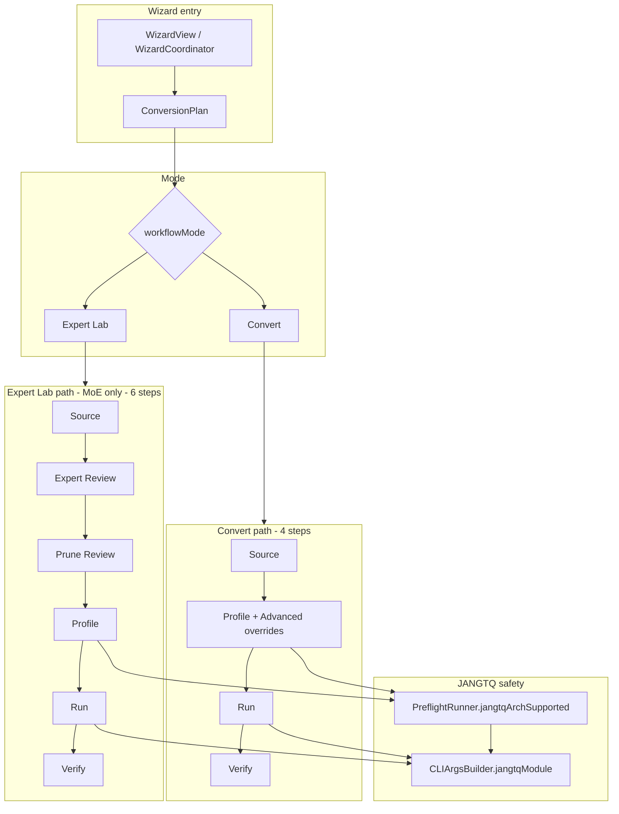
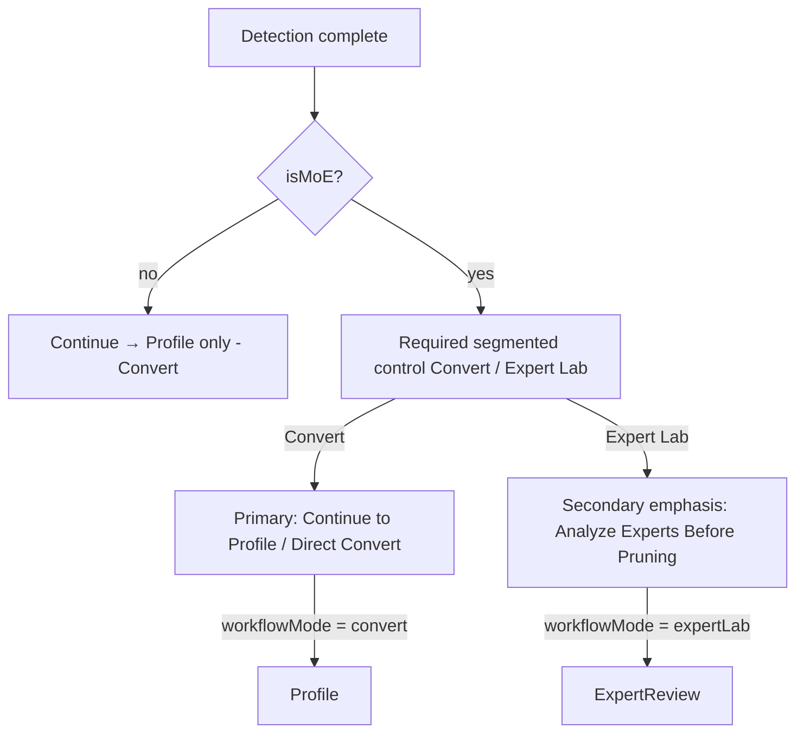
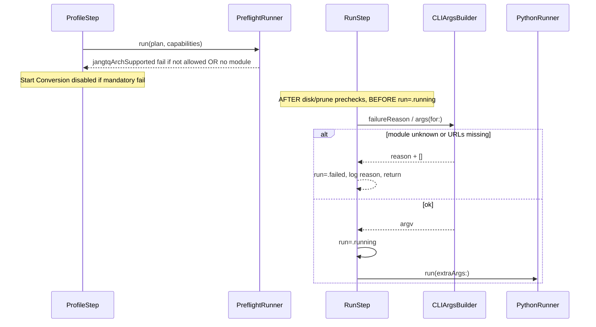

# JANG Studio — Convert vs Expert Lab Mode Separation, CLIArgsBuilder Hard-Fail, Architecture Step Cleanup

| Field | Value |
|---|---|
| **Author** | _TBD_ |
| **Date** | 2026-07-12 |
| **Status** | Draft (rev 3 — migration heal aligned) |
| **Codebase** | `/Users/hermes/Documents/Codex/2026-06-22/rea/work/jangq/JANGStudio` |
| **Parent monorepo** | `/Users/hermes/Documents/Codex/2026-06-22/rea/work/jangq` |

---

## Overview

JANG Studio has outgrown its original 5-step convert wizard. Runtime today is a single 6-step sidebar (`source → expertReview → pruneReview → profile → run → verify`) where Expert Lab is the MoE primary path and dense models still see locked Expert Review / Prune Review rows. Documentation still describes a 5-step Architecture-confirm flow. Meanwhile `ArchitectureStep.swift` remains compiled and tested but is unreachable from `WizardStep`, and `CLIArgsBuilder` silently routes unknown JANGTQ architectures to the Qwen converter.

This design fixes three tightly related product and correctness problems in three incremental PRs:

1. **Hard-fail unknown JANGTQ converter selection** in `CLIArgsBuilder` (safety, no UX risk).
2. **Retire the orphaned Architecture step** by merging advanced overrides into Profile and deleting dead code/tests. (Until PR2 lands, recommendation may still seed `plan.overrides`, but the live wizard has no editor for them — that gap closes in PR2.)
3. **Introduce an explicit Convert vs Expert Lab mode switch** so the sidebar, step numbering, and Source CTAs match product intent.

---

## Background & Motivation

### Current state (verified in tree)

| Surface | Actual behavior |
|---|---|
| `WizardStep` (`WizardCoordinator.swift:276–288`) | `source, expertReview, pruneReview, profile, run, verify` — 6 cases, **no** `architecture` |
| Sidebar (`WizardView`) | `List(WizardStep.allCases, …)` — always shows all 6 |
| `canActivate(.expertReview)` | Requires `isStep1Complete && detected.isMoE` — dense users see locked rows |
| `canActivate(.profile)` | Blocks when `expertReviewIntent == .smartPrequantPrune` and prune not adopted |
| `ArchitectureStep.swift` | Full UI for detection review + force dtype/block size; still in `project.pbxproj` Sources |
| `isStep2Complete` | Alias of `isStep1Complete` (`ConversionPlan.swift:169`) — vestigial “confirm architecture” gate |
| README / USER_GUIDE | 5-step wizard with Architecture as step 2 |
| `CLIArgsBuilder` JANGTQ branch | `default: "jang_tools.convert_qwen35_jangtq"` — silent wrong converter |
| Tests | `test_unknownJANGTQArchFallsBackToQwenConverter` **pins the bug as intended behavior** |
| Plan persistence | `encodeForDefaults` / `decodeFromDefaults` used in **tests**; production `WizardView` holds a fresh `@State` plan; diagnostics write `plan.json` for bug reports only — **no production UserDefaults resume path today** |

### Pain points

1. **Identity mismatch.** README sells simple convert; MoE users land in Expert Lab-first UX (Source still kicks with “Expert Lab primary path”); dense users see locked Expert Lab steps with no explanation of why they exist.
2. **Silent wrong conversion.** If preflight is bypassed or `family` is forced to `.jangtq` with a non-whitelisted / unmapped `model_type`, RunStep invokes the Qwen JANGTQ module against the wrong architecture — failure modes range from confusing Python errors to corrupted partial outputs.
3. **Dead Architecture surface.** Overrides (`forceDtype`, `forceBlockSize`) are only editable in `ArchitectureStep`, which is not in the step enum. Recommendation can still seed overrides; power users cannot change them in the live wizard until PR2. Tests and docs still pretend the step is live.

### Explicitly out of scope

- Splitting `ExpertLabSheet` / `PostConvertVerifier` god files
- Python bundle slim / notarization release engineering
- Full design-system rewrite (follow `docs/DESIGN_DIRECTION.md` for any new chrome)

---

## Goals & Non-Goals

### Goals

- G1. Never invoke a JANGTQ converter module unless the detected architecture maps to a known module; surface a clear hard-block in UI/preflight/Run.
- G2. Convert happy path is short: **Source → Profile → Run → Verify** (4 steps).
- G3. Expert Lab path is explicit and MoE-only: **Source → Expert Review → Prune Review → Profile → Run → Verify** (6 steps).
- G4. Dense models never see Expert Lab sidebar steps.
- G5. Architecture overrides remain available without a dedicated orphaned step.
- G6. Incremental, independently mergeable PRs; test + doc updates land with the behavior they describe.

### Non-Goals

- N1. Changing Expert Lab sheet internals or prune algorithms.
- N2. Expanding JANGTQ whitelist (e.g. GLM) — only the hard-fail contract for unmapped types.
- N3. Persisting multi-plan history or project files (no production plan resume today; do not add one in this work).
- N4. Renumbering `isStepNComplete` APIs globally (keep aliases; document meaning).

---

## Key Decisions

| # | Decision | Rationale |
|---|---|---|
| K1 | **PR order: CLIArgsBuilder → Architecture cleanup → Mode switch** | Safety first (no UX risk); architecture cleanup unblocks honest step numbering; mode switch is the product-facing change and benefits from a clean 4/6 step base. |
| K2 | **Delete Architecture as a wizard step; merge Advanced overrides into ProfileStep** | Source already shows detection summary; Profile already owns conversion knobs; reinserting Architecture lengthens Convert (conflicts with G2) and reintroduces a step docs already over-sold. Overrides still flow through `plan.overrides` → `CLIArgsBuilder`. |
| K3 | **Store mode as `ConversionPlan.workflowMode: WizardMode`** | Mode is per-conversion state (like `expertReviewIntent`), not a global preference. Lives on the plan for: (a) unit-test fixtures, (b) diagnostics `plan.json`, (c) future-proofing if resume is added later. **Not** because production restores plans from UserDefaults today — it does not. AppSettings would wrong-apply across unrelated models. |
| K4 | **Default mode = `.convert`; Expert Lab only when `detected.isMoE` and user opts in** | Preserves short happy path; avoids forcing MoE users into Expert Lab when they want Direct Convert. |
| K5 | **Hide (not lock) MoE-only steps outside Expert Lab mode** | Locked rows with lock icons create mixed signal (current dense UX). Filtering the sidebar list is clearer than greying out unreachable steps. |
| K6 | **CLIArgsBuilder returns `[]` for unknown JANGTQ module (same contract as missing URLs); RunStep refuses to start *before* `run = .running`** | Keeps pure builder API; avoids throw-through async run loop churn. Complement with preflight fail + explicit log line. |
| K7 | **JANGTQ module resolution uses `architectureModelTypes` (modelType + textModelType), not `modelType` alone** | Matches `isJANGTQAllowed(for:)` and VL wrapper cases (`qwen3_5_moe_wrapper` + `textModelType: qwen3_5_moe_text`). Align preflight `jangtqArchSupported` the same way. |
| K8 | **Keep module map in Swift next to whitelist consumption; do not invent a second hardcoded whitelist** | Whitelist stays on `Capabilities.jangtqWhitelist`. Module map is a separate concern (converter binary identity). When whitelist grows without a module entry, hard-fail (safe). |
| K9 | **`WizardStep.title` is name-only; numbered labels only via `displayTitle(for:)`** | Avoid Convert showing `4 · Conversion Profile` when steps 2–3 are gone; single API for all UI/tests. |
| K10 | **Preflight requires whitelist ∩ module map** | G1 demands Profile red-row before Run. `jangtqArchSupported` fails unless `isJANGTQAllowed` **and** `jangtqModule(for:) != nil`. |
| K11 | **`ensureActiveIsVisible()` after every mode/visibility-affecting mutation** | Prevents SwiftUI `List` selection desync when `active` is filtered out of `visibleSteps()`. |
| K12 | **Codable migration upgrades only *in-progress* Expert Lab sessions; heal inconsistent explicit `convert`** | Post-adopt plans with only `expertReviewPrunedSourceURL` stay `.convert`. Matches runtime adopt → `.convert`. If decoded mode is `.convert` but in-progress session fields remain (missing key **or** explicit `"workflowMode":"convert"`), upgrade to `.expertLab` — do not leave contradictory blobs. Explicit `.expertLab` is always honored. |
| K13 | **Source CTA hierarchy: Convert default primary; Expert Lab secondary; segmented control required for MoE** | Fixes identity mismatch beyond sidebar filtering alone. |
| K14 | **No feature-flag kill-switch for mode switch** | Rollback = revert PR3 commit. No `AppSettings.useWizardModes`. |

---

## Proposed Design

### High-level architecture



### WizardMode model

```swift
/// Per-conversion product path. Independent of ExpertReviewIntent
/// (intent is the in-lab prune workflow state; mode is navigation).
enum WizardMode: String, Codable, CaseIterable {
    case convert
    case expertLab
}
```

On `ConversionPlan`:

```swift
var workflowMode: WizardMode = .convert
```

**CodingKeys:** add `workflowMode`. Decode with `decodeIfPresent` defaulting to `.convert`, then **migration upgrade** only for in-progress Expert Lab sessions (see Migration).

**Relationship to existing fields:**

| Field | Role after change |
|---|---|
| `workflowMode` | Which sidebar / step sequence is active |
| `expertReviewIntent` | Inside Expert Lab: whether smart prequant prune is in progress (unchanged semantics) |
| `detected.isMoE` | Gate: may select `.expertLab` only when true |

### Mode mutation API (single place callers use)

Prefer thin helpers so CTAs cannot forget mode + visibility invariants:

```swift
// On WizardCoordinator (or ConversionPlan + coordinator wrapper)
func setWorkflowMode(_ mode: WizardMode) {
    plan.workflowMode = mode
    if mode == .convert {
        // Clear in-progress Expert Lab session only (not adopted pruned source).
        if plan.expertReviewIntent == .smartPrequantPrune
            || plan.expertReviewPlanURL != nil
            || plan.expertReviewSourceURL != nil {
            plan.expertReviewIntent = .none
            plan.expertReviewPlanURL = nil
            plan.expertReviewSourceURL = nil
            // Keep expertReviewPrunedSourceURL / original / report if already adopted.
        }
    }
    ensureActiveIsVisible()
}

func enterExpertLabReview() {
    // Called by startExpertReview / Open BF16 Expert Review
    guard plan.detected?.isMoE == true else {
        setWorkflowMode(.convert)
        return
    }
    plan.workflowMode = .expertLab
    plan.expertReviewIntent = .smartPrequantPrune
    plan.expertReviewSourceURL = plan.sourceURL
    plan.expertReviewPlanURL = nil
    ensureActiveIsVisible()
    active = .expertReview  // only if canActivate; else stays source
}

/// Invariant: `active` is always an element of `visibleSteps()`.
func ensureActiveIsVisible() {
    guard !visibleSteps().contains(active) else { return }
    if canActivate(.profile) {
        active = .profile
    } else {
        active = .source
    }
}
```

### Setting mode (normative table)

| User action / hook | `workflowMode` | Side effects | Call `ensureActiveIsVisible`? |
|---|---|---|---|
| **`SourceStep.adoptSource`** (folder re-pick) | **always `.convert`** | Existing clear of all `expertReview*` fields + `detected` remains; new conversion starts clean | Yes |
| **Detection completes, `!detected.isMoE`** | force `.convert` | Expert Lab unavailable; clear any residual expert fields if present | Yes |
| **Detection completes, `isMoE`** | leave current (default already `.convert` after adoptSource) | Segmented control becomes enabled | Yes (no-op if already visible) |
| **`startExpertReview()` / “Analyze Experts…”** | `.expertLab` via `enterExpertLabReview()` | intent + source URL setup; `active = .expertReview` | Yes |
| **“Open BF16 Expert Review”** (ExpertReviewStep) | `.expertLab` | same intent setup | Yes |
| **“Direct Convert Without Pruning”** (Source **and** Expert Review) | `.convert` via `setWorkflowMode(.convert)` | clear in-progress session; `active = .profile` if `canActivate` | Yes |
| **Segmented control → Convert** | `.convert` via `setWorkflowMode` | clear in-progress session; snap active if needed | Yes |
| **Segmented control → Expert Lab** | `.expertLab` | do **not** invent prune state; if Expert Review not ready, `active = .source` | Yes |
| **`adoptReviewedPrunedSource`** | **`.convert`** | existing field clearing; final quantize is Convert path | Yes (caller/coordinator after adopt) |
| **`VerifyStep.reset()` / Convert another** | `.convert` (fresh `ConversionPlan()`) | re-apply settings defaults | Yes (new coordinator active = source) |

### WizardStep enum (unchanged cases; name-only titles)

Keep the enum cases stable to minimize churn in `canActivate` and switches that name cases:

```swift
enum WizardStep: Int, CaseIterable, Identifiable {
    case source = 1, expertReview, pruneReview, profile, run, verify
    var id: Int { rawValue }

    /// Name only — never includes step numbers.
    /// Numbered labels: WizardCoordinator.displayTitle(for:).
    var title: String {
        switch self {
        case .source:       "Source Model"
        case .expertReview: "Expert Review"
        case .pruneReview:  "Prune Review"
        case .profile:      "Conversion Profile"
        case .run:          "Build / Convert"
        case .verify:       "Verify"
        }
    }
}
```

**Normative rule:** UI and tests that show `"N · Name"` **must** use `displayTitle(for:)`. Tests that only need the name may use `WizardStep.title`. No code may reintroduce fixed `"1 · …"` … `"6 · …"` strings on the enum.

### Visibility + selection helpers

```swift
extension WizardCoordinator {
    /// Steps shown in the sidebar for the current plan mode + detection.
    func visibleSteps() -> [WizardStep] {
        switch plan.workflowMode {
        case .convert:
            return [.source, .profile, .run, .verify]
        case .expertLab:
            // Expert Lab mode is only valid for MoE; fall back to Convert list if mis-set.
            guard plan.detected?.isMoE == true else {
                return [.source, .profile, .run, .verify]
            }
            return [.source, .expertReview, .pruneReview, .profile, .run, .verify]
        }
    }

    func displayTitle(for step: WizardStep) -> String {
        let index = (visibleSteps().firstIndex(of: step) ?? 0) + 1
        return "\(index) · \(step.title)"
    }
}
```

`WizardView` list:

```swift
List(coord.visibleSteps(), selection: Binding(
    get: { coord.active },
    set: { newValue in
        guard let step = newValue else { return }
        // Defense in depth: ignore steps not in the current mode list,
        // and still gate on canActivate (M176).
        guard coord.visibleSteps().contains(step),
              coord.canActivate(step) else { return }
        coord.active = step
    }
)) { step in
    HStack {
        Image(systemName: stepIcon(step))
        Text(coord.displayTitle(for: step))
    }
    ...
    .tag(step)
}
.onChange(of: coord.plan.workflowMode) { _, _ in
    coord.ensureActiveIsVisible()
}
.onChange(of: coord.plan.detected?.isMoE) { _, _ in
    coord.ensureActiveIsVisible()
}
```

**Invariant:** After any mutation that can change `visibleSteps()` (mode, detection, adopt, reset), `ensureActiveIsVisible()` runs so `active` is never an expert-only step while the list is Convert-shaped.

### canActivate matrix (after change)

| Step | Convert mode | Expert Lab mode |
|---|---|---|
| `source` | always | always |
| `expertReview` | **false** (and not visible) | `isStep1Complete && detected.isMoE` |
| `pruneReview` | **false** (not visible) | `expertReviewPlanURL != nil && expertReviewSourceURL != nil` (unchanged) |
| `profile` | `isStep1Complete` (via `isStep2Complete`) | same + smart-prune gate: if `expertReviewIntent == .smartPrequantPrune` then require pruned source adopted (unchanged) |
| `run` | `isStep3Complete` + reviewed-prune verified if pruned source present | same |
| `verify` | `isStep4Complete` | same |

Implementation sketch:

```swift
func canActivate(_ step: WizardStep) -> Bool {
    // Mode-invisible steps are never activatable (defense in depth).
    guard visibleSteps().contains(step) else { return false }

    switch step {
    case .source:
        return true
    case .expertReview:
        return plan.isStep1Complete && plan.detected?.isMoE == true
    case .pruneReview:
        return plan.expertReviewPlanURL != nil && plan.expertReviewSourceURL != nil
    case .profile:
        if plan.expertReviewIntent == .smartPrequantPrune,
           plan.expertReviewPrunedSourceURL == nil {
            return false
        }
        return plan.isStep2Complete
    case .run:
        if plan.expertReviewPrunedSourceURL != nil,
           PreflightRunner.reviewedPruneVerifiedCheck(plan: plan)?.status != .pass {
            return false
        }
        return plan.isStep3Complete
    case .verify:
        return plan.isStep4Complete
    }
}
```

**Fixture note for tests:** After PR3, `canActivate(.expertReview)` is false for default `workflowMode = .convert` even when MoE is detected. Every Expert Lab path unit fixture **must** set `plan.workflowMode = .expertLab` (or call `enterExpertLabReview()`) before asserting expert gates.

### Mode selection UX (SourceStep) — normative for PR3

After detection:



Concrete UI rules:

1. **Dense:** collapse the “Expert Lab & pruning” section (or replace with a single caption that Expert Lab is MoE-only). Primary forward action: **Continue → Profile** with `setWorkflowMode(.convert)`.
2. **MoE — required segmented control** `Convert | Expert Lab` bound through `setWorkflowMode` / `enterExpertLabReview` path:
   - **Convert** (default after folder pick): “Profile → quantize → verify. Skip expert prune.”
   - **Expert Lab**: “Trace → mask/compare → BF16/F16 prune → then quantize.”
3. **CTA hierarchy when Convert selected (default):**
   - Primary (borderedProminent): **Continue to Profile** / “Direct Convert Without Pruning”.
   - Secondary (bordered or plain): “Analyze Experts Before Pruning” — selecting it flips mode to Expert Lab and navigates (or instruct user to switch segment first; prefer one-shot: CTA calls `enterExpertLabReview()`).
   - **Remove / rename** the kicker `"Expert Lab primary path"` when `workflowMode == .convert`. When Expert Lab segment is selected, kicker may read `"Expert Lab path"` (not “primary path” as product default).
4. **CTA hierarchy when Expert Lab selected:**
   - Primary: “Analyze Experts Before Pruning” / open review.
   - Secondary: “Direct Convert Without Pruning” → `setWorkflowMode(.convert)` + profile.
5. **Router-only prune** remains available under Convert mode for supported Qwen MoE (does not set Expert Lab mode).
6. Mode switches always end in `ensureActiveIsVisible()` (via `setWorkflowMode`).

### Architecture cleanup (merge, then delete)

**Decision: do not reinsert Architecture into `WizardStep`.**

| Content today in ArchitectureStep | Destination |
|---|---|
| Detected architecture summary + plain-English captions | Already largely on SourceStep “Detected” section; optional one-line “Reviewed at Source” on Profile is enough |
| Advanced overrides (force dtype, block size) + GuidanceCards | **ProfileStep** new `DisclosureGroup("Advanced overrides")` after Options section, gated to `family == .jang` (JANGTQ converters ignore these flags today — `CLIArgsBuilderTests.test_jangtqIgnoresAdvancedOverridesForNow`) |
| “Looks right → Profile” button | Deleted; Source/mode CTAs own forward nav |

Delete:

- `JANGStudio/Wizard/Steps/ArchitectureStep.swift`
- **`project.pbxproj` references** (PBXFileReference + PBXBuildFile + group entry). `project.yml` does **not** enumerate step files (folder-based / XcodeGen does not list ArchitectureStep today) — do **not** expect a project.yml line. If the team regenerates via XcodeGen, re-run after delete and confirm the target builds; if editing pbxproj by hand, remove all three reference sites.
- Architecture-specific assertions in `WizardStepContinueGateTests` (replace with Profile override gate if any)

Keep:

- `ArchitectureOverrides` model + Codable (still used by recommendation + CLI)
- Preflight rules that read `plan.overrides.forceDtype` (e.g. fp16 + 512 experts)
- CLI flag emission for JANG family

`isStep2Complete` remains `isStep1Complete` with an updated comment:

```swift
/// Historically “architecture confirmed”. Architecture is no longer a wizard
/// step; profile remains unlocked once source detection succeeds.
var isStep2Complete: Bool { isStep1Complete }
```

### CLIArgsBuilder hard-fail

#### Current bug (`CLIArgsBuilder.swift:27–32`)

```swift
case .jangtq:
    let mod: String = switch plan.detected?.modelType ?? "" {
        case "qwen3_5_moe", "qwen3_5_moe_text": "jang_tools.convert_qwen35_jangtq"
        case "minimax_m2":  "jang_tools.convert_minimax_jangtq"
        default: "jang_tools.convert_qwen35_jangtq"  // silent wrong converter
    }
```

#### Proposed API

```swift
enum CLIArgsBuilder {
    /// model_type / text_model_type token → python -m module.
    /// Intentionally separate from Capabilities.jangtqWhitelist:
    /// whitelist = UI allow; map = which binary to run.
    static let jangtqModuleByModelType: [String: String] = [
        "qwen3_5_moe": "jang_tools.convert_qwen35_jangtq",
        "qwen3_5_moe_text": "jang_tools.convert_qwen35_jangtq",
        "minimax_m2": "jang_tools.convert_minimax_jangtq",
    ]

    /// First matching architectureModelTypes entry wins (order: modelType then textModelType).
    static func jangtqModule(for plan: ConversionPlan) -> String? {
        guard let detected = plan.detected else { return nil }
        for token in detected.architectureModelTypes {
            if let mod = jangtqModuleByModelType[token] { return mod }
        }
        return nil
    }

    /// Pure reason string for empty argv — unit-testable without RunStep UI.
    /// Returns nil when args(for:) would be non-empty.
    static func failureReason(for plan: ConversionPlan) -> String? {
        if plan.sourceURL == nil || plan.outputURL == nil {
            return "Cannot build converter argv: sourceURL and outputURL are required."
        }
        if plan.family == .jangtq, jangtqModule(for: plan) == nil {
            let types = plan.detected?.architectureModelTypes.joined(separator: ", ") ?? "(none)"
            return "Cannot build converter argv: JANGTQ has no module mapping for model types [\(types)]. Use a JANG profile, or pick a supported architecture."
        }
        return nil
    }

    static func args(for plan: ConversionPlan) -> [String] {
        guard let src = plan.sourceURL?.path, let out = plan.outputURL?.path else { return [] }
        switch plan.family {
        case .jang:
            // unchanged (including overrides → -b / --force-dtype)
            ...
        case .jangtq:
            guard let mod = jangtqModule(for: plan) else { return [] }
            return ["-m", mod, "--progress=json", "--quiet-text", src, out, plan.profile]
        }
    }
}
```

#### Defense layers (all three required)



1. **Profile / preflight (PR1 — normative, not optional):** when `family == .jangtq`:

   ```swift
   private static func jangtqArchSupported(plan: ConversionPlan, whitelist: [String]) -> PreflightCheck {
       if plan.family != .jangtq {
           return .init(id: .jangtqArchSupported, title: "JANGTQ arch supported", status: .pass, hint: nil)
       }
       let allowed = plan.isJANGTQAllowed(for: whitelist)
       let module = CLIArgsBuilder.jangtqModule(for: plan)
       if allowed, module != nil {
           return .init(id: .jangtqArchSupported, title: "JANGTQ arch supported", status: .pass, hint: nil)
       }
       if !allowed {
           let mt = plan.detected?.architectureModelTypes.joined(separator: ", ") ?? "?"
           return .init(id: .jangtqArchSupported, title: "JANGTQ arch supported", status: .fail,
                        hint: "JANGTQ supports \(whitelist.joined(separator: ", ")); detected [\(mt)]")
       }
       // Whitelisted (or would be) but Studio has no converter module entry yet.
       let mt = plan.detected?.architectureModelTypes.joined(separator: ", ") ?? "?"
       return .init(id: .jangtqArchSupported, title: "JANGTQ arch supported", status: .fail,
                    hint: "No JANGTQ converter module mapped for [\(mt)] in this Studio build. Use a JANG profile.")
   }
   ```

   Fail status blocks `allMandatoryPass()`.

2. **CLIArgsBuilder:** empty args if no module map hit (even if somehow on whitelist without a module — future GLM).

3. **RunStep.start — exact insertion point (PR1):** after reviewed-prune / disk prechecks that already exist, **before** `coord.plan.run = .running` and **before** clearing logs for a new run (or: clear logs, then fail — but never set `.running`):

   ```swift
   // Pseudocode insertion in start():
   // ... existing disk / reviewed-prune guards that return early ...

   if let reason = CLIArgsBuilder.failureReason(for: coord.plan) {
       coord.plan.run = .failed
       logs.append("[error] \(reason)")
       return
   }
   let args = CLIArgsBuilder.args(for: coord.plan)
   // assert !args.isEmpty given failureReason == nil

   coord.plan.run = .running
   cancelRequested = false
   sawSuccessfulDone = false
   // ... proceed with PythonRunner(extraArgs: args)
   ```

   Distinct strings from `failureReason` cover missing URLs vs unmapped JANGTQ. Unit-test `failureReason` / `args` without driving SwiftUI.

Optional hardening (same PR if small): when `family == .jangtq` and `!isJANGTQAllowed`, ensure family cannot stick on `.jangtq` after source re-detect to non-whitelisted type (reset to `.jang`).

### Sidebar filtering rules (summary)

| Detection | Mode | Sidebar steps |
|---|---|---|
| nil / incomplete Source | convert (default) | Source, Profile*, Run*, Verify* (*locked until gates) |
| Dense | convert only | Source, Profile, Run, Verify |
| MoE | convert | Source, Profile, Run, Verify |
| MoE | expertLab | Source, Expert Review, Prune Review, Profile, Run, Verify |
| Dense but `workflowMode` corrupted to expertLab | treat as convert list (guard in `visibleSteps`) + `ensureActiveIsVisible` | Source, Profile, Run, Verify |

Icons: existing `stepIcon` logic remains; only iterate `visibleSteps()`.

---

## API / Interface Changes

### New / changed public surface (app-internal)

| Symbol | Change |
|---|---|
| `WizardMode` | **New** enum |
| `ConversionPlan.workflowMode` | **New** property + Codable |
| `WizardCoordinator.visibleSteps()` | **New** |
| `WizardCoordinator.displayTitle(for:)` | **New** — sole source of `"N · Name"` labels |
| `WizardCoordinator.ensureActiveIsVisible()` | **New** — selection invariant |
| `WizardCoordinator.setWorkflowMode` / `enterExpertLabReview` | **New** preferred mutation API |
| `WizardStep.title` | **Name-only** (drop fixed `1…6` prefixes) |
| `CLIArgsBuilder.jangtqModule(for:)` | **New** |
| `CLIArgsBuilder.jangtqModuleByModelType` | **New** static map |
| `CLIArgsBuilder.failureReason(for:)` | **New** pure diagnostic for empty argv |
| `CLIArgsBuilder.args(for:)` | JANGTQ unknown → `[]` instead of Qwen fallback |
| `ArchitectureStep` | **Deleted** |
| `ProfileStep` | Gains Advanced overrides disclosure |
| `SourceStep.adoptSource` | Always `workflowMode = .convert` |
| Detection completion | Force `.convert` if dense |
| `SourceStep.startExpertReview()` | `enterExpertLabReview()` |
| Direct Convert buttons (Source + Expert Review) | `setWorkflowMode(.convert)` |
| `PreflightRunner.jangtqArchSupported` | `isJANGTQAllowed` **and** module map hit |
| `RunStep.start` | Empty-argv check **before** `run = .running` |

### Before / after args (unknown arch)

**Before (bug):**

```
family=.jangtq, modelType=glm_moe_dsa
→ ["-m", "jang_tools.convert_qwen35_jangtq", ..., src, out, "JANGTQ2"]
```

**After:**

```
→ []
+ preflight fail "JANGTQ arch supported" (whitelist and/or module)
+ RunStep refuses to start with explicit log (before .running)
```

### WizardStep title before / after (Convert MoE direct)

| Before (always, fixed on enum) | After Convert (`displayTitle`) | After Expert Lab (`displayTitle`) |
|---|---|---|
| 1 · Source Model | 1 · Source Model | 1 · Source Model |
| 2 · Expert Review (locked) | — hidden — | 2 · Expert Review |
| 3 · Prune Review (locked) | — hidden — | 3 · Prune Review |
| 4 · Conversion Profile | 2 · Conversion Profile | 4 · Conversion Profile |
| 5 · Build / Convert | 3 · Build / Convert | 5 · Build / Convert |
| 6 · Verify | 4 · Verify | 6 · Verify |

`WizardStep.title` alone: `"Source Model"`, `"Expert Review"`, … (no numbers).

---

## Data Model Changes

### Schema

```swift
// ConversionPlan CodingKeys — add:
case workflowMode

// init(from:):
workflowMode = try c.decodeIfPresent(WizardMode.self, forKey: .workflowMode) ?? .convert

// Migration / heal (normative — runs whether key was missing or present):
// Upgrade convert + in-progress session fields → expertLab.
// Do NOT upgrade solely because expertReviewPrunedSourceURL != nil (post-adopt).
// Explicit expertLab is never downgraded here.
if workflowMode == .convert {
    let inProgressSession =
        expertReviewIntent == .smartPrequantPrune
        || (expertReviewPlanURL != nil && expertReviewSourceURL != nil)
    if inProgressSession {
        workflowMode = .expertLab  // heal inconsistent convert + live session
    }
}
// Note: do NOT use c.contains(.workflowMode) to skip heal — explicit
// "workflowMode":"convert" with residual smart-prune fields is treated as
// inconsistent diagnostics/fixture data and upgraded.
```

### Migration strategy (normative residual-field table)

Applies after decode of `workflowMode` (default `.convert` if key absent). **Heal rule:** if resulting mode is `.convert` and an in-progress Expert Lab session is present, set `.expertLab`. In-progress = `expertReviewIntent == .smartPrequantPrune` **or** (`expertReviewPlanURL != nil` **and** `expertReviewSourceURL != nil`).

| JSON / residual fields after field decode | Expected `workflowMode` |
|---|---|
| No `workflowMode` key; all expert fields nil/none | `.convert` |
| No key; `expertReviewIntent == .smartPrequantPrune` (URLs may be partial) | `.expertLab` (upgrade) |
| No key; both `expertReviewPlanURL` and `expertReviewSourceURL` set | `.expertLab` (upgrade) |
| No key; only one of planURL/sourceURL set; intent `.none` | `.convert` (incomplete; do not invent Expert Lab chrome) |
| No key; only `expertReviewPrunedSourceURL` (± original/report) — post-adopt shape | **`.convert`** (no upgrade on pruned-only) |
| No key; full post-adopt + outputURL for final quantize | `.convert` |
| Explicit `"workflowMode":"expertLab"` (any residual fields) | **`.expertLab`** (honor; no downgrade) |
| Explicit `"workflowMode":"convert"` **without** in-progress session fields | **`.convert`** (honor) |
| Explicit `"workflowMode":"convert"` **with** in-progress session fields | **`.expertLab`** (heal inconsistent blob — same as missing-key upgrade) |

**Runtime rule (always):**

```swift
func adoptReviewedPrunedSource(_ prunedURL: URL) {
    // ... existing field rewrites ...
    workflowMode = .convert  // prune done; final quantize is Convert path
}
```

Coordinator (or call site) then `ensureActiveIsVisible()` so if user was on Prune Review, selection snaps to Profile/Source under Convert list.

This matches product language: Expert Lab ends at verified pruned BF16/F16; Profile/Run/Verify are conversion. Profile’s existing “Reviewed BF16/F16 Source” section remains the post-adopt affordance (no Expert Review step required).

### Persistence

- No AppSettings key for mode.
- `ConversionPlan` remains `Codable` for:
  - unit tests (`encodeForDefaults` / `decodeFromDefaults`);
  - diagnostics bundles (`plan.json`);
  - future-proofing if a resume path is added later.
- **Production today:** `WizardView` creates a fresh `WizardCoordinator` / `ConversionPlan`; `VerifyStep.reset` allocates a new plan. There is **no** live UserDefaults plan restore. Migration logic still ships for diagnostics round-trips and tests — not because users resume Expert Lab after an app upgrade via defaults.
- No migration script beyond decoder logic.

---

## Alternatives Considered

### A1. Reinsert Architecture as Convert-only step 2

- **Pros:** Matches README/USER_GUIDE literally; keeps ArchitectureStep investment; clear “confirm detection” pause.
- **Cons:** Lengthens happy path (anti-G2); detection already shown on Source; Expert Lab path would be 7 steps or asymmetric; more canActivate matrix complexity.
- **Rejected** in favor of merge-into-Profile (K2).

### A2. Keep single 6-step sidebar; only unlock Expert steps for MoE (status quo + polish)

- **Pros:** Minimal code change.
- **Cons:** Dense users still see dead steps; numbering lies; product identity remains confused.
- **Rejected** for G3/G4.

### A3. Separate root coordinators / NavigationStacks per mode

- **Pros:** Maximum isolation.
- **Cons:** Duplicates Profile/Run/Verify; high rewrite cost; deferred as follow-up if mode filtering proves insufficient.
- **Rejected** for incremental PR plan.

### A4. CLIArgsBuilder throws instead of `[]`

- **Pros:** Explicit error type at call site.
- **Cons:** Touches every caller; current pure `[]` contract for incomplete plans is established in tests.
- **Rejected** for PR1; can revisit if RunStep empty-args cases proliferate. `failureReason(for:)` covers diagnostics without throws.

### A5. Drive module map from `jang-tools capabilities --json`

- **Pros:** Single source of truth with Python.
- **Cons:** Capabilities schema change + bundle version coupling; frozen fallback must carry map; out of PR scope.
- **Deferred** — note in Open Questions; Swift static map mirrors whitelist frozen snapshot pattern.

### A6. Store mode only ephemerally on WizardCoordinator (not on plan)

- **Pros:** No Codable change.
- **Cons:** Harder to test via ConversionPlan fixtures; diagnostics `plan.json` would omit mode; future resume would need a redesign.
- **Rejected** (K3) — even without production resume, plan ownership is correct.

---

## Security & Privacy Considerations

| Topic | Assessment |
|---|---|
| Auth | Unchanged — local conversion only |
| Path handling | CLIArgsBuilder still passes user-chosen absolute paths; hard-fail does not reduce validation |
| Wrong-converter risk | **Reduced** — primary security/integrity win of PR1 (avoid running architecture-specific quant code on wrong tensors) |
| Expert Lab data | Mode switch does not change what Expert Lab writes; clearing session fields on mode exit reduces accidental reuse of stale prune plans |
| Telemetry | None assumed |

Threat mitigated: **integrity** — silent wrong quantizer module selection.

---

## Observability

| Signal | Where | Action |
|---|---|---|
| Empty JANGTQ argv / missing URLs | RunStep log via `failureReason` | User-visible; distinct messages |
| Preflight `jangtqArchSupported` fail | Profile Pre-flight list (whitelist vs no-module hints) | Existing UI |
| Mode transitions | Optional debug log under Settings verbosity (nice-to-have) | Not required for v1 |
| Metrics / crash analytics | N/A unless app already ships them | No new backend |

No new alert channels. Diagnostics zip (`DiagnosticsBundle`) already includes plan JSON — after change it will contain `workflowMode`, aiding bug reports.

---

## Rollout Plan

### Feature flags

**Do not implement** a feature-flag kill-switch (`AppSettings.useWizardModes` or similar). Flags are not required for correctness/navigation work and create half-flag debt.

**Only rollback path for PR3:** revert the PR3 commit (decoder still tolerates a leftover `workflowMode` key in any diagnostic JSON).

### Staged rollout

1. **PR1** — CLIArgsBuilder + preflight (whitelist ∩ module) + RunStep pre-`.running` guard + tests. Ship immediately. *Note: override editing UX gap remains until PR2 (recommendation can seed overrides; Profile editor lands in PR2).*
2. **PR2** — Architecture merge/delete + Profile Advanced overrides UI + test/doc partial. Ship after PR1 green. Closes override editing gap.
3. **PR3** — Mode switch + sidebar + Source UX + full doc sync. Ship after PR2.

### Rollback

| PR | Rollback |
|---|---|
| PR1 | Revert commit; restore default Qwen fallback only if emergency (not recommended) |
| PR2 | Revert; ArchitectureStep file restore from git + pbxproj |
| PR3 | **Revert PR3 commit only** (no kill-switch flag) |

### Risk register

| Risk | Severity | Mitigation |
|---|---|---|
| RunStep empty args from missing URLs misdiagnosed as JANGTQ | Low | `failureReason` distinct messages; check before `.running` |
| Sidebar `active` desync after mode filter | High (if unmitigated) | `ensureActiveIsVisible` on every mode/detect/adopt/reset path (K11) |
| Expert Lab fixtures fail `canActivate` under default convert | High (if unmitigated) | All expert-path tests set `workflowMode = .expertLab` |
| Diagnostic/fixture decode of post-adopt without mode key | Low | Migration does not upgrade on pruned-source alone (K12) |
| “In-flight Expert Lab resume after upgrade” | **Low** (no production plan restore today) | Migration still correct for fixtures/diagnostics; not a user-facing upgrade path |
| Source-inspection tests brittle after Architecture delete | Low | Rewrite tests in same PR |
| VL wrapper JANGTQ module miss | Med | Use `architectureModelTypes` (K7); explicit wrapper fixture in PR1 |
| Mode switch clears prune state unexpectedly | Med | Only clear in-progress session on Convert; keep adopted pruned source |
| PR3 concentrated regression surface | Med | Internal land order checklist inside PR3 |

---

## Test Plan Updates

### PR1 — CLIArgsBuilder / preflight

| File | Change |
|---|---|
| `CLIArgsBuilderTests.swift` | **Delete/replace** `test_unknownJANGTQArchFallsBackToQwenConverter` → `test_unknownJANGTQArchReturnsEmptyArgs` |
| same | Add `test_jangtqModule_usesTextModelTypeForWrapper` using the **existing fixture shape** from `ConversionPlanTests`: `modelType: "qwen3_5_moe_wrapper"`, `textModelType: "qwen3_5_moe_text"`, `isVL: true` → non-empty args, module `jang_tools.convert_qwen35_jangtq` |
| same | Add `test_unknownModelType_nilTextModelType_returnsEmptyArgs` (`modelType: "some_other_moe"`, no text type) |
| same | Add `test_failureReason_distinguishesMissingURLsVsUnmappedJANGTQ` |
| same | Add `test_jangtqModule_nilWhenDetectedMissing` |
| `PreflightRunnerTests.swift` | **Pass:** same wrapper fixture (`qwen3_5_moe_wrapper` + `qwen3_5_moe_text`) with `family == .jangtq` and whitelist containing `qwen3_5_moe_text` |
| same | **Fail:** unknown modelType, nil textModelType, `family == .jangtq` |
| same | **Fail with no-module hint:** if test injects a type on whitelist but not in `jangtqModuleByModelType` (synthetic), expect fail hint mentioning mapping |
| `CoverageMatrixTests.swift` | Ensure JANGTQ cells still build non-empty args only for mapped types |

### PR2 — Architecture cleanup

| File | Change |
|---|---|
| `WizardStepContinueGateTests.swift` | Remove `test_architectureStep_continue_is_gated`; add Profile Advanced overrides presence shape test (DisclosureGroup + forceDtype binding) |
| `CLIArgsBuilderTests` overrides cases | Unchanged (flags still work) |
| Build | Delete swift file; scrub pbxproj **or** XcodeGen regen; confirm target builds |
| Optional UI test | Profile can set forceBlockSize (if XCUITest harness allows) |

### PR3 — Mode switch

#### Tests that will fail and the fixture fix

| Test / pin (current) | Why it fails after PR3 | Fix |
|---|---|---|
| `ExpertLabWorkflowFlowTests.test_reviewedExpertWorkflowGatesUntilPrunedSourceIsAdoptedAndVerified` | Sets MoE detection, expects `canActivate(.expertReview) == true` with default mode | Set `workflowMode = .expertLab` (or `enterExpertLabReview`) **before** expert gate asserts; after adopt assert mode `.convert` and expert steps not visible |
| `ExpertLabWorkflowFlowTests` `WizardStep.allCases.map(\.title)` pin of fixed `"1 · …"`…`"6 · …"` | `title` becomes name-only | Assert `WizardStep.allCases.map(\.title)` equals name-only list **or** assert `displayTitle` under expertLab mode for visible steps |
| `WizardStepContinueGateTests` expert-lab primary workflow title pin (same pattern) | Same | Same — use `displayTitle` / `visibleSteps()` |
| `AppSettingsTests.test_wizardCoordinator_canActivate_gates_unreached_steps` | Fresh plan still OK (convert, expert false) | Keep; **add** dense MoE-convert case: expert not visible; and expertLab fixture where expert becomes true |
| `WizardFlowTests.test_sidebarListsFiveSteps` (misnamed; asserts **six** static titles) | Launch is Convert → 4 rows; titles mode-aware | Assert 4 Convert titles at launch; separate test for MoE Expert Lab → 6 after mode enter |
| Source-inspection pins of `"Expert Lab primary path"` | Copy removed/renamed under Convert | Update string pins to new Convert-default copy / Expert Lab segment copy |
| Any test asserting `active` remains `.expertReview` after adopt | adopt → convert + `ensureActiveIsVisible` | Expect snap to `.profile` or `.source` |

#### Additional PR3 coverage

| File | Change |
|---|---|
| `ConversionPlanTests.swift` | Codable round-trip `workflowMode`; **in-progress** migration without key (intent or plan+source URLs) → `.expertLab`; **post-adopt without key** (only pruned source) → `.convert`; **explicit `"workflowMode":"convert"` + `expertReviewIntent == .smartPrequantPrune` → `.expertLab` (heal)**; explicit convert without session fields stays convert; explicit expertLab honored; `adoptReviewedPrunedSource` sets `.convert` |
| `WizardModeVisibilityTests` (optional but recommended) | Table-driven `visibleSteps` / `ensureActiveIsVisible` matrix |
| Manual QA | See checklist below |

### Manual QA checklist

1. Dense llama → 4 steps, convert JANG_4K, verify green.
2. Qwen3 MoE default Convert → segmented control on Convert; **no** “Expert Lab primary path” kicker; 4 sidebar steps; Direct Convert works.
3. Qwen3 MoE Expert Lab full path → 6 steps, prune adopt → sidebar collapses to Convert numbering; `active` not stuck on Prune Review.
4. Mid Expert Lab, re-pick dense folder → mode `.convert`, 4 steps, no desync blank detail.
5. Force JANGTQ + unsupported type → preflight red, Start disabled; if forced past, Run fails **without** flash of running, clear log (no Python wrong-module).
6. Wrapper VL (`qwen3_5_moe_wrapper` / text `qwen3_5_moe_text`) JANGTQ → preflight green, args use Qwen module.
7. Advanced overrides on Profile → CLI contains `-b` / `--force-dtype` for JANG.

---

## Documentation Updates

| Doc | Updates |
|---|---|
| `README.md` | Replace “5-step wizard” with dual-mode description: Convert (4 steps) and Expert Lab MoE (6 steps). Remove Architecture as step 2. |
| `docs/USER_GUIDE.md` | Restructure: Mode overview → Convert walkthrough → Expert Lab walkthrough. Move Advanced overrides under Profile. Document segmented control + CTA hierarchy. |
| `docs/TROUBLESHOOTING.md` | Add row: “Run fails: no JANGTQ module mapping” → use JANG family or supported arch. Add: “Expert Lab steps missing” → switch Source segmented control to Expert Lab (MoE only). Remove Architecture-step assumptions if any. |
| `docs/CONTRIBUTING.md` | Wizard folder list without ArchitectureStep; note `WizardMode`; pbxproj/XcodeGen note for step files. |
| `docs/PROGRESS_PROTOCOL.md` | No change unless argv empty case documented for external frontends. |
| `docs/DESIGN_DIRECTION.md` | Optional one-liner: mode badge in top bar may show Convert vs Expert Lab (aligns with existing “current mode” note). |

---

## Open Questions

1. **Post-adopt prune report affordance:** After `adoptReviewedPrunedSource`, mode is Convert. Existing Profile “Reviewed BF16/F16 Source” section is the intended affordance — confirm no separate “re-open Expert Review” CTA is required for v1.
2. **Capabilities-driven module map:** Worth a jang-tools schema addition in a later release?
3. **Mode control placement beyond Source:** Segmented control is **required on Source** for MoE. Optional later: also mirror mode badge in toolbar per `DESIGN_DIRECTION` — not blocking PR3.
4. **Router-only prune from Source without Expert Lab:** Remains under Convert for supported Qwen MoE (recommend keep). Confirm product wants that escape hatch labeled clearly as non-reviewed.

~~5. Should preflight require module map hit?~~ **Decided (K10):** yes — `isJANGTQAllowed` **and** `jangtqModule(for:) != nil` in PR1.

---

## References

- `JANGStudio/Wizard/WizardCoordinator.swift` — `WizardStep`, `canActivate`, `WizardView`, Expert Review / Prune Review steps
- `JANGStudio/Models/ConversionPlan.swift` — plan state, step completeness, `isJANGTQAllowed`, Codable, `adoptReviewedPrunedSource`
- `JANGStudio/Runner/CLIArgsBuilder.swift` — argv construction (bug site)
- `JANGStudio/Runner/CapabilitiesService.swift` — `jangtqWhitelist` frozen + CLI
- `JANGStudio/Wizard/Steps/ArchitectureStep.swift` — orphaned UI
- `JANGStudio/Wizard/Steps/SourceStep.swift` — `adoptSource`, detection, Expert Lab CTAs, Direct Convert
- `JANGStudio/Wizard/Steps/ProfileStep.swift` — family/profile/preflight
- `JANGStudio/Wizard/Steps/RunStep.swift` — `start()` / `buildArgs()` / PythonRunner
- `JANGStudio/Verify/PreflightRunner.swift` — `jangtqArchSupported`
- Tests: `CLIArgsBuilderTests`, `WizardStepContinueGateTests`, `ExpertLabWorkflowFlowTests`, `ConversionPlanTests`, `CoverageMatrixTests`, `WizardFlowTests`
- Docs: `README.md`, `docs/USER_GUIDE.md`, `docs/TROUBLESHOOTING.md`, `docs/DESIGN_DIRECTION.md`
- Prior app review notes (2026-07-12) — mode clarity, CLIArgsBuilder bug, Architecture orphan

---

## PR Plan

### PR1 — CLIArgsBuilder JANGTQ hard-fail (no UX risk)

| | |
|---|---|
| **Title** | fix(studio): hard-fail unknown JANGTQ converter module selection |
| **Depends on** | None |
| **Files / components** | `JANGStudio/Runner/CLIArgsBuilder.swift` (`jangtqModule`, `failureReason`, empty args); `JANGStudio/Verify/PreflightRunner.swift` (`jangtqArchSupported` = whitelist ∩ module); `JANGStudio/Wizard/Steps/RunStep.swift` (empty-args guard **before** `run = .running`); `Tests/JANGStudioTests/CLIArgsBuilderTests.swift`; `Tests/JANGStudioTests/PreflightRunnerTests.swift`; optionally `CoverageMatrixTests.swift` |
| **Description** | Replace silent Qwen default with `jangtqModule(for:)` over `architectureModelTypes`. Return `[]` when unmapped. Preflight fails unless allowed **and** module mapped (distinct hints). RunStep uses `failureReason` before setting `.running`. Invert fallback test. Explicit fixtures: `qwen3_5_moe_wrapper`+`qwen3_5_moe_text` pass; unknown modelType empty/fail. |

### PR2 — Architecture step cleanup (merge overrides into Profile)

| | |
|---|---|
| **Title** | refactor(studio): merge Architecture overrides into Profile; delete orphan step |
| **Depends on** | PR1 recommended (independent in theory; land after PR1 to keep reviews small) |
| **Files / components** | `JANGStudio/Wizard/Steps/ArchitectureStep.swift` (**delete**); `JANGStudio/Wizard/Steps/ProfileStep.swift` (Advanced overrides DisclosureGroup + GuidanceCards); `JANGStudio/Models/ConversionPlan.swift` (comment on `isStep2Complete`); **`JANGStudio.xcodeproj/project.pbxproj`** (remove PBX refs — `project.yml` has no per-file entry); `Tests/JANGStudioTests/WizardStepContinueGateTests.swift`; `docs/USER_GUIDE.md` (Architecture → Profile advanced); partial `README.md` if it still names Architecture as step 2 |
| **Description** | Move force dtype / block size UI to Profile (JANG family). Remove dead ArchitectureStep and its continue-gate source test. Confirm build after pbxproj scrub or XcodeGen regen. Document that detection confirmation lives on Source. Closes override editing gap left after PR1. No WizardStep enum change yet. |

### PR3 — Convert vs Expert Lab mode separation

| | |
|---|---|
| **Title** | feat(studio): Convert vs Expert Lab wizard modes with filtered sidebar |
| **Depends on** | PR2 (clean 4-step Convert path without Architecture baggage); PR1 (safety already landed) |
| **Files / components** | `JANGStudio/Models/ConversionPlan.swift` (`WizardMode`, `workflowMode`, Codable migration K12, `adoptReviewedPrunedSource`); `JANGStudio/Wizard/WizardCoordinator.swift` (`visibleSteps`, `displayTitle`, `ensureActiveIsVisible`, `setWorkflowMode`, `enterExpertLabReview`, `canActivate` guard, name-only `WizardStep.title`); `JANGStudio/Wizard/Steps/SourceStep.swift` (`adoptSource` → convert, dense force, required segmented control, CTA hierarchy); Expert Review Direct Convert path in `WizardCoordinator.swift`; `JANGStudio/Wizard/Steps/VerifyStep.swift` reset; Tests per “will fail and fix” table; Docs: `README.md`, `docs/USER_GUIDE.md`, `docs/TROUBLESHOOTING.md`, `docs/CONTRIBUTING.md` |
| **Description** | Introduce per-plan `workflowMode`. Filter sidebar to Convert (4) vs Expert Lab (6). Dynamic step numbering via `displayTitle`. Dense never sees Expert steps. Wire all mode mutation hooks. Migration only for in-progress sessions. Full dual-mode documentation + Source CTA hierarchy. |

#### PR3 internal land order (same PR, sequential commits recommended)

1. **Model + migration + unit tests** — `WizardMode`, Codable table, `adoptReviewedPrunedSource` → convert, ConversionPlanTests.
2. **`visibleSteps` / `canActivate` / `ensureActiveIsVisible` / name-only titles** — coordinator + ExpertLabWorkflowFlowTests / title pins.
3. **Wire CTAs** — `adoptSource`, Direct Convert (both sites), `enterExpertLabReview`, Verify reset.
4. **Source chrome** — required segmented control, CTA hierarchy, remove “primary path” kicker under Convert.
5. **Docs + UI tests** — README/USER_GUIDE/TROUBLESHOOTING/CONTRIBUTING; `WizardFlowTests` 4-vs-6.

If review bandwidth is tight, optionally split (4)+(5) Source polish into a fast-follow PR3b; **do not** ship (1)–(3) without `ensureActiveIsVisible` (selection desync is critical). Prefer single user-visible ship when possible.

### Suggested merge order rationale


- **PR1 alone** is shippable mid-cycle with pure safety benefit (override *editing* still missing until PR2 — by design).
- **PR2** removes doc/code contradiction and restores override editor without changing MoE product path.
- **PR3** is the user-visible navigation redesign; smaller surface after PR2 deletes Architecture fiction; use internal checklist to control risk.

### Out-of-order alternative (not recommended)

Mode switch before Architecture cleanup would force PR3 to either hide Architecture (already absent) or reintroduce it only for Convert — extra thrash. CLIArgsBuilder last would leave a known footgun during mode work. Stick to K1 order.
